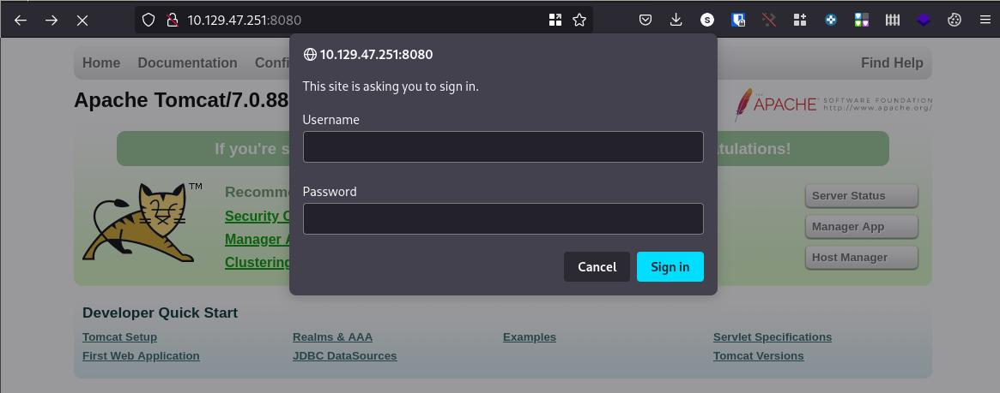
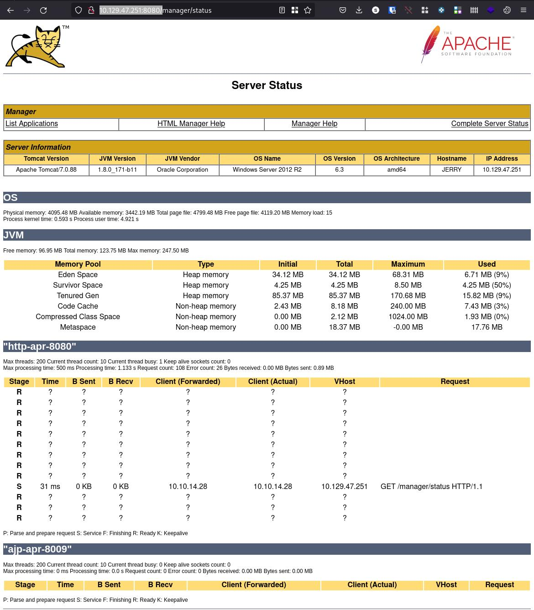

# Enumeration

Starting with nmap:

```shell
nmap -Pn -sC -sV 10.129.47.251 -o nmap.txt                                                                                              main 
Starting Nmap 7.92 ( https://nmap.org ) at 2022-09-09 11:16 CEST
Nmap scan report for 10.129.47.251
Host is up (0.030s latency).
Not shown: 999 filtered tcp ports (no-response)
PORT     STATE SERVICE VERSION
8080/tcp open  http    Apache Tomcat/Coyote JSP engine 1.1
|_http-title: Apache Tomcat/7.0.88
|_http-favicon: Apache Tomcat
|_http-server-header: Apache-Coyote/1.1

Service detection performed. Please report any incorrect results at https://nmap.org/submit/ .
Nmap done: 1 IP address (1 host up) scanned in 14.37 seconds
```

Check on browser tomcat and ask for login when try to serverstatus, manager app, host manager...



Trying with defualt credentials we can login (admin/admin):


