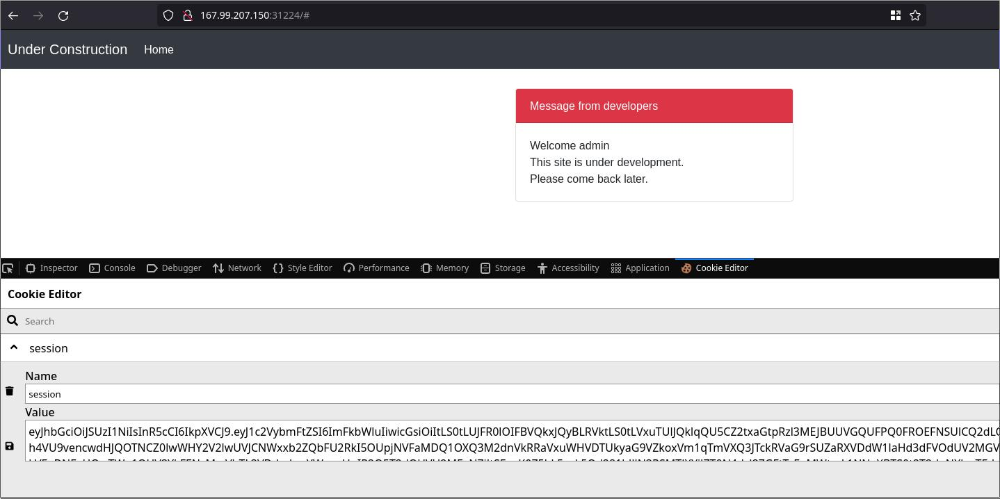

# Enumeration

nmap and gobuster:
```shell
└──╼ $nmap -sC -sV -Pn $SERVERIP -oN nmap.txt
Starting Nmap 7.92 ( https://nmap.org ) at 2022-09-25 21:04 CEST
Nmap scan report for 64.227.43.55
Host is up (0.035s latency).
Not shown: 905 filtered tcp ports (no-response), 94 closed tcp ports (conn-refused)
PORT      STATE SERVICE VERSION
30951/tcp open  http    Apache httpd 2.4.41 ((Ubuntu))
|_http-server-header: Apache/2.4.41 (Ubuntu)
|_http-title: Site doesn't have a title (text/html).

└──╼ $gobuster dir -w /usr/share/wordlists/dirb/common.txt -u http://64.227.43.55:30163 -o gobuster.txt
===============================================================
Gobuster v3.1.0
by OJ Reeves (@TheColonial) & Christian Mehlmauer (@firefart)
===============================================================
[+] Url:                     http://64.227.43.55:30163
[+] Method:                  GET
[+] Threads:                 10
[+] Wordlist:                /usr/share/wordlists/dirb/common.txt
[+] Negative Status codes:   404
[+] User Agent:              gobuster/3.1.0
[+] Timeout:                 10s
===============================================================
2022/09/25 21:12:01 Starting gobuster in directory enumeration mode
===============================================================
/auth                 (Status: 200) [Size: 2149]
/logout               (Status: 302) [Size: 27] [--> /auth]
                                                          
===============================================================
2022/09/25 21:12:16 Finished
```

After examine downloaded files, we fouces our investigation on JWT:

```shell
cat helpers/JWTHelper.js                                                                                                      main 
const fs = require('fs');
const jwt = require('jsonwebtoken');

const privateKey = fs.readFileSync('./private.key', 'utf8');
const publicKey  = fs.readFileSync('./public.key', 'utf8');

module.exports = {
    async sign(data) {
        data = Object.assign(data, {pk:publicKey});
        return (await jwt.sign(data, privateKey, { algorithm:'RS256' }))
    },
    async decode(token) {
        return (await jwt.verify(token, publicKey, { algorithms: ['RS256', 'HS256'] }));
    }

```
Lets register admin/admin User on web:


Login with admin user:


Get cookie info from browser:



Read information about [JWT](https://book.hacktricks.xyz/pentesting-web/hacking-jwt-json-web-tokens)


eyJhbGciOiJSUzI1NiIsInR5cCI6IkpXVCJ9.eyJ1c2VybmFtZSI6ImFkbWluIiwicGsiOiItLS0tLUJFR0lOIFBVQkxJQyBLRVktLS0tLVxuTUlJQklqQU5CZ2txaGtpRzl3MEJBUUVGQUFPQ0FROEFNSUlCQ2dLQ0FRRUE5NW9UbTlETnpjSHI4Z0xoalphWVxua3RzYmoxS3h4VU9vencwdHJQOTNCZ0lwWHY2V2lwUVJCNWxxb2ZQbFU2RkI5OUpjNVFaMDQ1OXQ3M2dnVkRRaVxuWHVDTUkyaG9VZkoxVm1qTmVXQ3JTckRVaG9rSUZaRXVDdW1laHd3dFVOdUV2MGV6QzU0WlRkRUM1WVNUQU96Z1xuaklXYWxzSGovZ2E1WkVEeDNFeHQwTWg1QUV3YkFENzMrcVhTL3VDdmhmYWpncHpIR2Q5T2dOUVU2MExNZjJtSFxuK0Z5bk5zak5Od281blJlN3RSMTJXYjJZT0N4dzJ2ZGFtTzFuMWtmL1NNeXBTS0t2T2dqNXkwTEdpVTNqZVhNeFxuVjhXUytZaVlDVTVPQkFtVGN6Mncya3pCaFpGbEg2Uks0bXF1ZXhKSHJhMjNJR3Y1VUo1R1ZQRVhwZENxSzNUclxuMHdJREFRQUJcbi0tLS0tRU5EIFBVQkxJQyBLRVktLS0tLVxuIiwiaWF0IjoxNjY0NjkyNDk4fQ.ZQWOUsFu3Rvy13ikJNqxXBKPTzPOub1D4KWxLpsZ1y5BSRxcZl2Wp3KNA09dcHAKaMb14xhAYWi8Eo65Q8g6M2-Ow2Xdj52n8oGJs-Ts2x4oojRicDTyI3FcaGUsP9N6MaVDwI3-5vITQyhIrLER2OW85-3gdFsrC6m4KkWY-YyYdFuGUGKi0WxMtXamGNjnIY-sJz20dURquNK8-drlfcXR8CCntwQFSXrfxmuRZSGFo3tJBzj0o9mMCPL2UetGP1P_47J3u5qvD_YXaJIQf-maeNqQs5CN-8ofc1WhnjCEI8LLPmLW4vjjD8Ci4gqB2iC4u76LMiOR_JmJJzUT5A

eyJhbGciOiJSUzI1NiIsInR5cCI6IkpXVCJ9.eyJ1c2VybmFtZSI6ImFkbWluIiwicGsiOiItLS0tLUJFR0lOIFBVQkxJQyBLRVktLS0tLVxuTUlJQklqQU5CZ2txaGtpRzl3MEJBUUVGQUFPQ0FROEFNSUlCQ2dLQ0FRRUE5NW9UbTlETnpjSHI4Z0xoalphWVxua3RzYmoxS3h4VU9vencwdHJQOTNCZ0lwWHY2V2lwUVJCNWxxb2ZQbFU2RkI5OUpjNVFaMDQ1OXQ3M2dnVkRRaVxuWHVDTUkyaG9VZkoxVm1qTmVXQ3JTckRVaG9rSUZaRXVDdW1laHd3dFVOdUV2MGV6QzU0WlRkRUM1WVNUQU96Z1xuaklXYWxzSGovZ2E1WkVEeDNFeHQwTWg1QUV3YkFENzMrcVhTL3VDdmhmYWpncHpIR2Q5T2dOUVU2MExNZjJtSFxuK0Z5bk5zak5Od281blJlN3RSMTJXYjJZT0N4dzJ2ZGFtTzFuMWtmL1NNeXBTS0t2T2dqNXkwTEdpVTNqZVhNeFxuVjhXUytZaVlDVTVPQkFtVGN6Mncya3pCaFpGbEg2Uks0bXF1ZXhKSHJhMjNJR3Y1VUo1R1ZQRVhwZENxSzNUclxuMHdJREFRQUJcbi0tLS0tRU5EIFBVQkxJQyBLRVktLS0tLVxuIiwiaWF0IjoxNjY0NjkzMzM4fQ.q3CtIrHHkuu57mtLmKx88v6kthekDC23J8LrXotHnhJ9xYwxFLRuXYHXH6VBdtdwZZ-QQdbZPFDctGNv_6oIF44oJkX28SKEzwHOBckkYO_XDcVwra3mEPXZTp8j2zb6rB29KrptW0S3p4AREZMw3UW5kvAIly9bc8Pe2-6iOR_nv7Zn5Q5PLIoo2YlMQCppo7jQY3ML3gGy5O1S6usJKg1zr8u44tizK17BolgzoVzgPz-zUhPdya4jFJaHV29-lVYM1nUVF_pbXAJ9wyrdX1RipKDGPJj8YvnzSj95DkLzkEgPokWOrqPEkTgEsRmB5VUv0TdQ_P8_a93o3YiUvg
