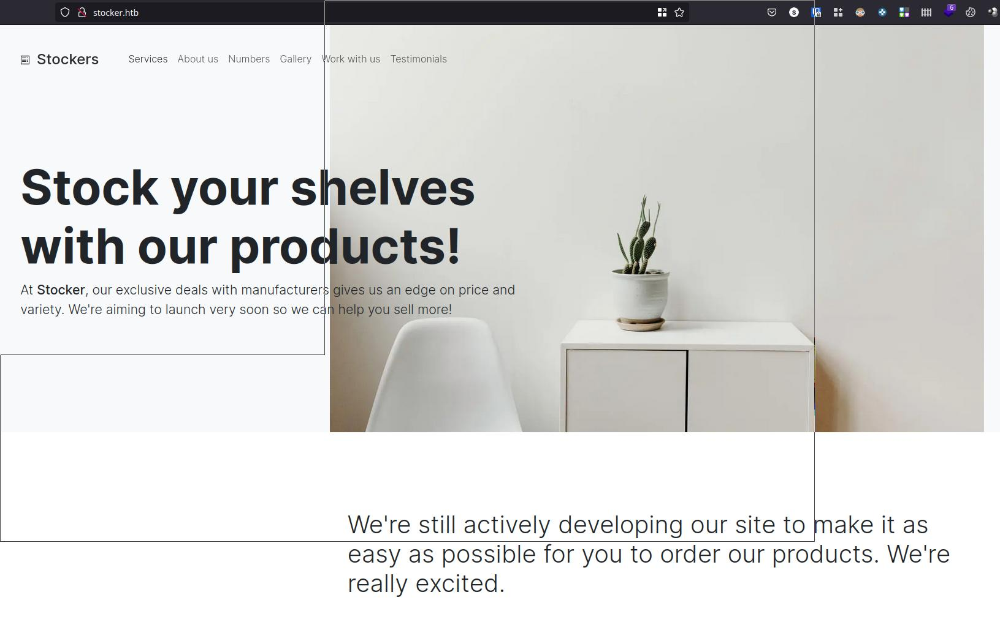

# Enumeration

Nmap:

```shell
# Nmap 7.93 scan initiated Sat Mar  4 22:15:17 2023 as: nmap -nP -sC -sV -vvv -o nmap.txt stocker.htb
Nmap scan report for stocker.htb (10.129.236.193)
Host is up, received syn-ack (0.035s latency).
Scanned at 2023-03-04 22:15:17 CET for 8s
Not shown: 998 closed tcp ports (conn-refused)
PORT   STATE SERVICE REASON  VERSION
22/tcp open  ssh     syn-ack OpenSSH 8.2p1 Ubuntu 4ubuntu0.5 (Ubuntu Linux; protocol 2.0)
| ssh-hostkey: 
|   3072 3d12971d86bc161683608f4f06e6d54e (RSA)
| ssh-rsa AAAAB3NzaC1yc2EAAAADAQABAAABgQC/Jyuj3D7FuZQdudxWlH081Q6WkdTVz6G05mFSFpBpycfOrwuJpQ6oJV1I4J6UeXg+o5xHSm+ANLhYEI6T/JMnYSyEmVq/QVactDs9ixhi+j0R0rUrYYgteX7XuOT2g4ivyp1zKQP1uKYF2lGVnrcvX4a6ds4FS8mkM2o74qeZj6XfUiCYdPSVJmFjX/TgTzXYHt7kHj0vLtMG63sxXQDVLC5NwLs3VE61qD4KmhCfu+9viOBvA1ZID4Bmw8vgi0b5FfQASbtkylpRxdOEyUxGZ1dbcJzT+wGEhalvlQl9CirZLPMBn4YMC86okK/Kc0Wv+X/lC+4UehL//U3MkD9XF3yTmq+UVF/qJTrs9Y15lUOu3bJ9kpP9VDbA6NNGi1HdLyO4CbtifsWblmmoRWIr+U8B2wP/D9whWGwRJPBBwTJWZvxvZz3llRQhq/8Np0374iHWIEG+k9U9Am6rFKBgGlPUcf6Mg7w4AFLiFEQaQFRpEbf+xtS1YMLLqpg3qB0=
|   256 7c4d1a7868ce1200df491037f9ad174f (ECDSA)
| ecdsa-sha2-nistp256 AAAAE2VjZHNhLXNoYTItbmlzdHAyNTYAAAAIbmlzdHAyNTYAAABBBNgPXCNqX65/kNxcEEVPqpV7du+KsPJokAydK/wx1GqHpuUm3lLjMuLOnGFInSYGKlCK1MLtoCX6DjVwx6nWZ5w=
|   256 dd978050a5bacd7d55e827ed28fdaa3b (ED25519)
|_ssh-ed25519 AAAAC3NzaC1lZDI1NTE5AAAAIIDyp1s8jG+rEbfeqAQbCqJw5+Y+T17PRzOcYd+W32hF
80/tcp open  http    syn-ack nginx 1.18.0 (Ubuntu)
| http-methods: 
|_  Supported Methods: GET HEAD
|_http-favicon: Unknown favicon MD5: 4EB67963EC58BC699F15F80BBE1D91CC
|_http-title: Stock - Coming Soon!
|_http-generator: Eleventy v2.0.0
|_http-server-header: nginx/1.18.0 (Ubuntu)
Service Info: OS: Linux; CPE: cpe:/o:linux:linux_kernel

Read data files from: /usr/bin/../share/nmap
Service detection performed. Please report any incorrect results at https://nmap.org/submit/ .
# Nmap done at Sat Mar  4 22:15:25 2023 -- 1 IP address (1 host up) scanned in 8.18 seconds
```

Dir gobuster:

```shell
/img                  (Status: 301) [Size: 178] [--> http://stocker.htb/img/]
/css                  (Status: 301) [Size: 178] [--> http://stocker.htb/css/]
/js                   (Status: 301) [Size: 178] [--> http://stocker.htb/js/]
/fonts                (Status: 301) [Size: 178] [--> http://stocker.htb/fonts/]
```

WhatWeb:

```shell
http://10.129.236.193 [301 Moved Permanently] Country[RESERVED][ZZ], HTTPServer[Ubuntu Linux][nginx/1.18.0 (Ubuntu)], IP[10.129.236.193], RedirectLocation[http://stocker.htb], Title[301 Moved Permanently], nginx[1.18.0]
```

Add entrie on /etc/hosts file:

```shell
sudo echo '10.129.237.131 stocker.htb' >> /etc/hosts
```

Open website and take a look on it:



Searching on website found some interesting infomation about Head of IT at Stockers Ltd name:


Write down this information maybe later will be very usefull.
At this point we http, ssh, and name from Head of IT, lets try to search vhosts with [gobuster](https://erev0s.com/blog/gobuster-directory-dns-and-virtual-hosts-bruteforcing/):


fuzz vhosts:

````shell

╰─ ffuf -w /usr/share/seclists/Discovery/DNS/namelist.txt -u http://stocker.htb -H "Host: FUZZ.stocker.htb" |grep -v "Status: 301"                                                       ─╯

        /'___\  /'___\           /'___\
       /\ \__/ /\ \__/  __  __  /\ \__/
       \ \ ,__\\ \ ,__\/\ \/\ \ \ \ ,__\
        \ \ \_/ \ \ \_/\ \ \_\ \ \ \ \_/
         \ \_\   \ \_\  \ \____/  \ \_\
          \/_/    \/_/   \/___/    \/_/

       v1.5.0
________________________________________________

 :: Method           : GET
 :: URL              : http://stocker.htb
 :: Wordlist         : FUZZ: /usr/share/seclists/Discovery/DNS/namelist.txt
 :: Header           : Host: FUZZ.stocker.htb
 :: Follow redirects : false
 :: Calibration      : false
 :: Timeout          : 10
 :: Threads          : 40
 :: Matcher          : Response status: 200,204,301,302,307,401,403,405,500
________________________________________________

dev                     [Status: 302, Size: 28, Words: 4, Lines: 1, Duration: 42ms]
:: Progress: [151265/151265] :: Job [1/1] :: 1172 req/sec :: Duration: [0:02:13] :: Errors: 0 ::
```